# 思考

1. 问：什么叫做“多范式计算机编程语言”？Python属于这类语言吗？为什么？
   答：**编程范式（Programming Paradigm）即“组织代码和解决问题的思维方式”。**如果一门语言支持多种编程风格且允许程序员自由选择不同方式解决问题，那么它就是多范式计算机编程语言。而Python是典型的多范式语言，因为它同时支持面向过程（Procedural）（小型脚本）；面向对象（OOP, Object-Oriented Programming）（大型项目）；函数式编程（Functional Programming）（数据处理）甚至是Pythonic的编程风格。

2. 问：Python中的生成器和迭代器，二者间有何联系？该如何更好的理解两者的概念？
   答：简言之，包含关系。**生成器（Generator）是一种“特殊的迭代器（Iterator）”。**迭代器一次返回一个值，记住当前位置且不必一次性加载所有数据。只要一个对象实现了__iter__和__next__这两种方法，它便是迭代器。而带yield的函数的调用以及生成器表达式都能返回生成器。生成器本质上是“自动帮你实现好的迭代器”（可以理解成Python预制好的迭代器）。

3. 问：有人说：”Python的类基本上仅仅是处理内置类型函数的包。“，怎么理解这句话？
   答：于表象上看，类是函数的包装，而鉴于Python函数的功能强大（有些时候并非是“非类不可”）以及内置类型的本质也是类（不同于Java的“万物须是类”，Python讲究“一切皆对象”），可以说这句话是试图从更容易接受和理解类的角度来解释类。但是，千万不能真就简单的把类当作是函数的包装。**类 = 数据 + 行为** 的绑定，类可以表达现实世界的模型，类拥有继承，多态等工程核心能力，更准确地说，类是组织复杂系统的一种工具，只看成是函数的包装就过于片面了。Python的类确实不是必须的，但在复杂问题中确实是不可替代的，Python的类不仅仅是为了“让代码能运行”，更多的还是为了“让代码能长期演进”。

4. 问：谈及Python的实现，什么叫做Python的标准实现？除此之外还有Jython；IronPython甚至是CPython，它们分别是什么，又是出于何种目的产生的？C和Python到底有何联系？
   答：首先要理解的一点是：Python ≠ 某一个程序，**Python = 一门语言规范 + 多种实现**。而所谓的标准实现通常指“官方、最主流、最被广泛使用的实现”。CPython就是Python的标准实现，同时它是C写的。简单地说，不同的Python实现可以理解为不同的“Python执行引擎”，更形象地说，Python类比为英语，不同的实现就会类比成不同的口音/翻译系统。只要遵守语法，不同的实现表达的都是“Python”，但运行方式不同。要记住，Python是“语言规范”，而非“唯一程序”。

   额外的：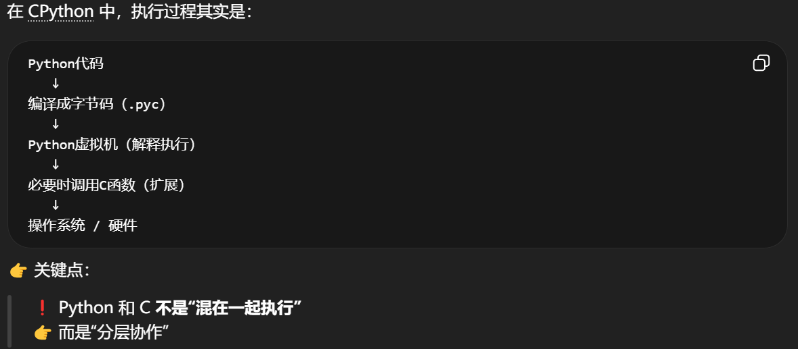

   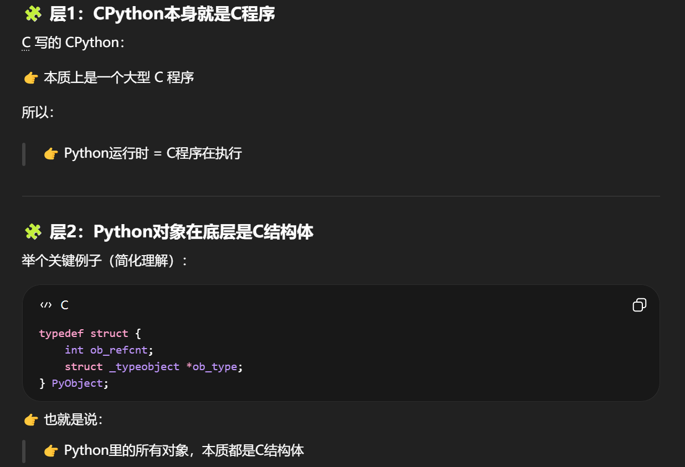

   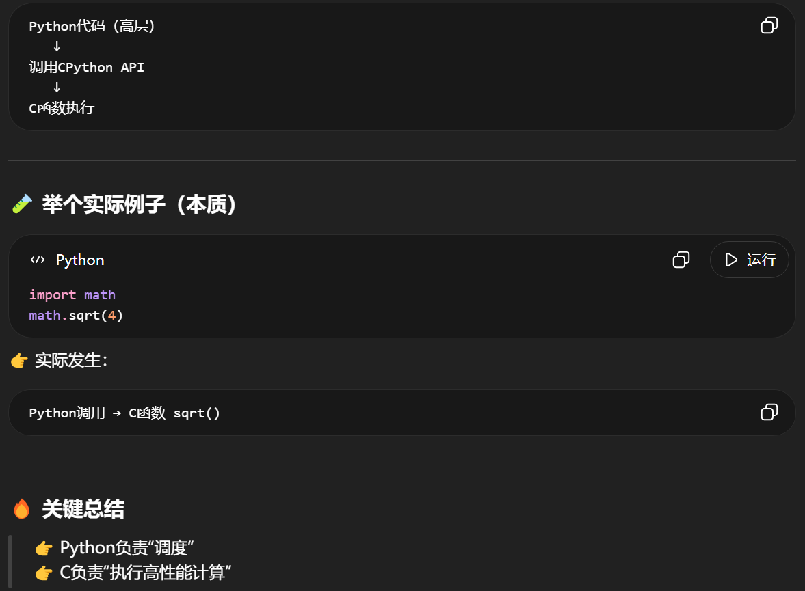

   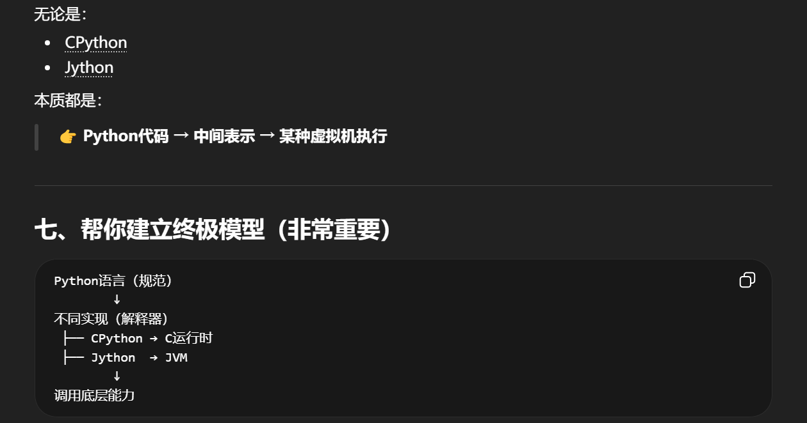

   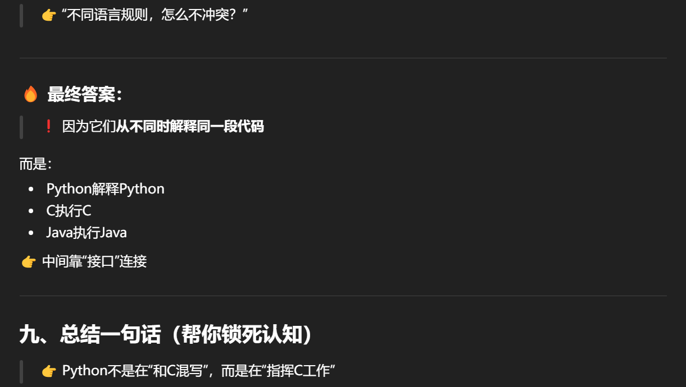

   

   此外，在此陈述自身对Python实现的理解：所谓的“一门编程语言的实现”，就是一个过程：将按照这门编程语言的规范所产出的源代码，通过某种方式解释（翻译）给计算机，以让其明白程序员的本意并如预期般做出行动。整个过程的重中之重便是“翻译”的步骤，完成这一步的或是编译器，或是解释器。而对于Python而言，它的动态语言特性使其更依赖运行期机制；而 CPython 采用了“先编译为字节码，再由虚拟机执行”的实现策略，以换取开发灵活性和跨平台性，但也牺牲了一部分执行性能。鉴于Python解释器的作用，可以笼统地说，Python解释器是Python实现的“具象化”，它决定了Python代码怎么执行，再准确一点说：Python 语言规范定义“代码应该表现成什么样”；而具体实现，比如 CPython、PyPy、Jython、IronPython，则决定“这个表现如何被实际执行”。CPython 的常见执行模型可以概括为：Python源代码 --> 字节码（中间产物，特定于Python实现的低级表示）--> Python虚拟机（运行时引擎，负责解释执行字节码指令）。这里要避免把“虚拟机”理解成一定类似 VMware 那样的完整硬件虚拟环境；在 CPython 语境下，它主要指解释字节码的运行时执行器。由此带来的结果包括：①由于它跳过了传统编译型语言面向机器码的显式编译及链接步骤，所以提升了Python的开发效率（这是Python的核心优势之一）；②将“编译 + 解释”步骤主要置入运行阶段，固然减轻了开发压力，但也换来了执行性能不如许多静态编译语言的问题；③字节码和虚拟机的存在还有各自的作用，带来了：针对二者的改变所产出的Python实现变体（Jython、IronPython、PyPy甚至是冻结二进制文件），而Python本身拥有简洁的语法和动态类型的特性，甚至还有标准库和第三方生态的支持，这些能够显著提高开发效率的特点跟特别针对语言集成所产出的实现变体相辅相成，使得Python成为久负盛名的“胶水语言”（这是Python的核心优势之一）似乎也是自然而然的。
   
   关于 Jython/IronPython：
   
   
   
   关于冻结二进制文件：
   
   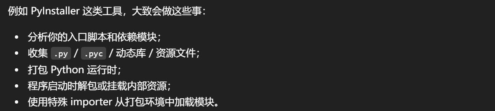
   
   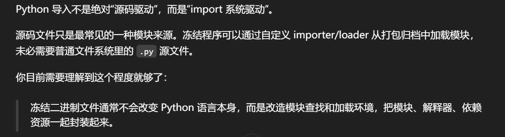
   
5. 问：谈及Python的应用，包括但不限于系统编程；GUI；Internet脚本；组件集成；数据库编程；快速原型；数值计算和科学计算编程；游戏开发；数据挖掘等等，首先，CGI脚本是什么？其次，这些应用领域人们通常更倾向于使用何种编程语言，Python与其相比有何优劣势？
   答：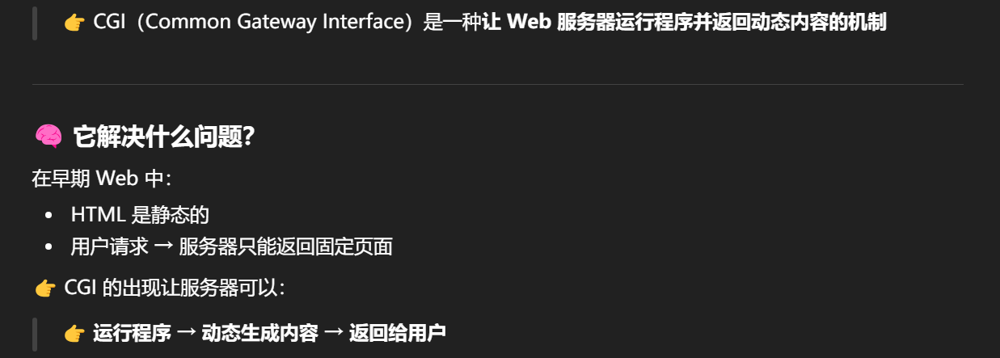

   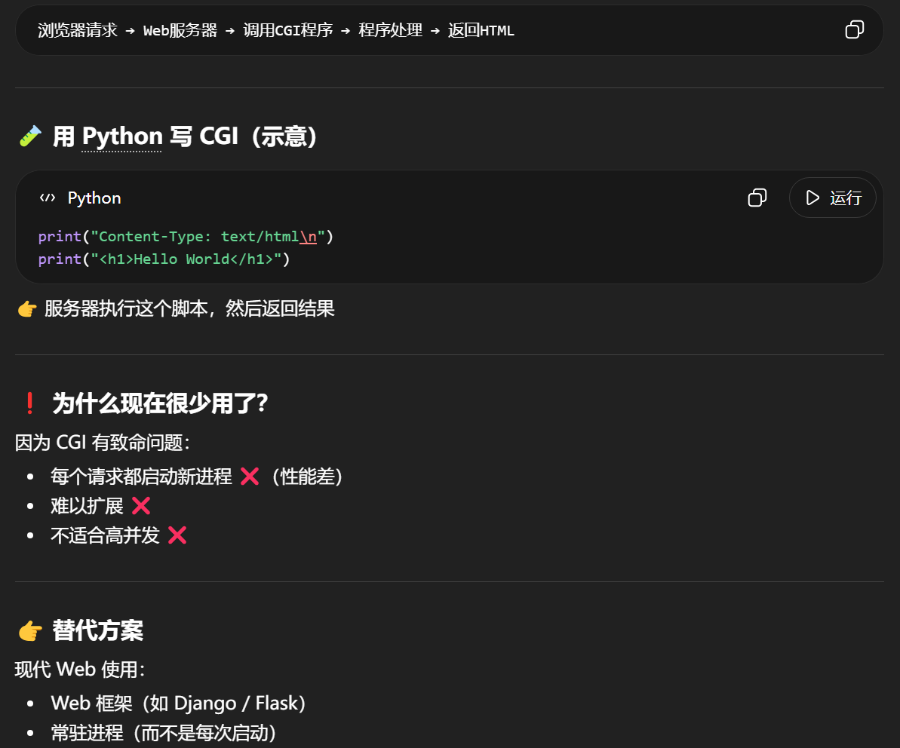

   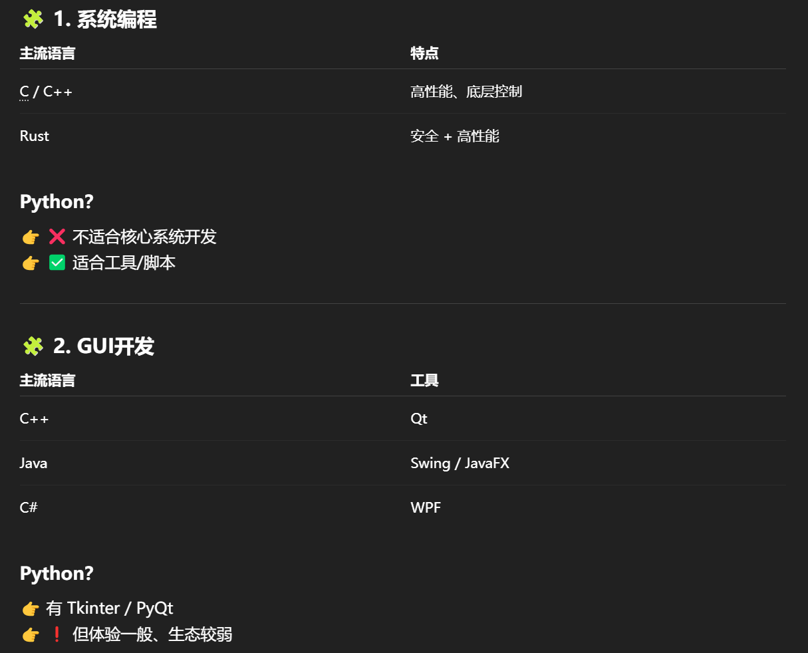

   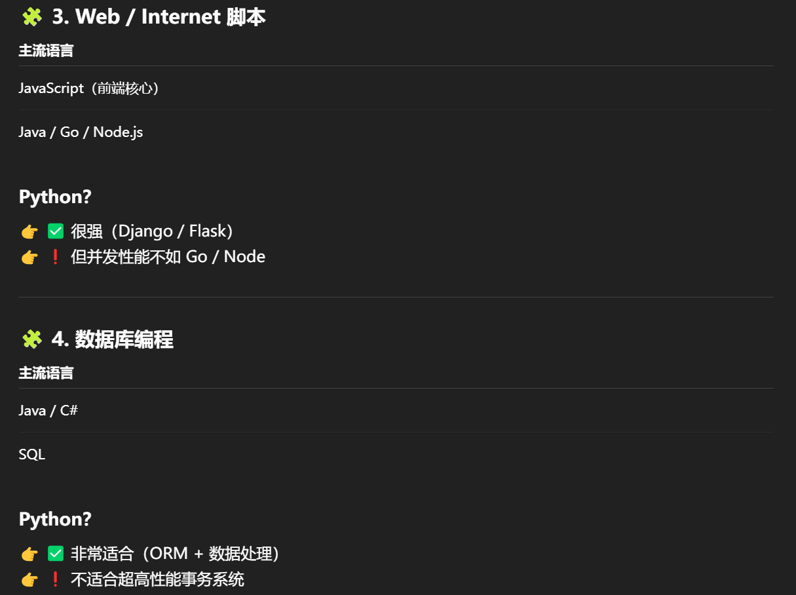

   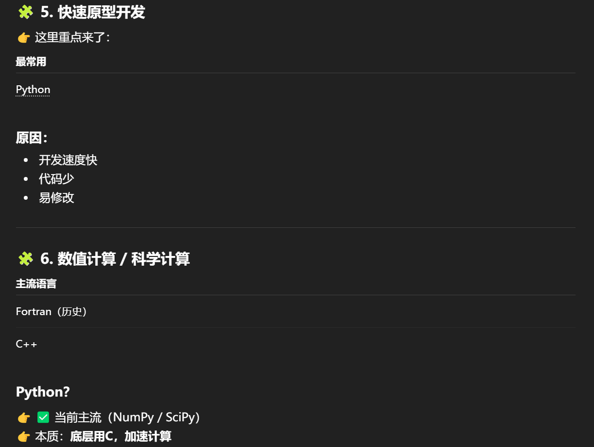

   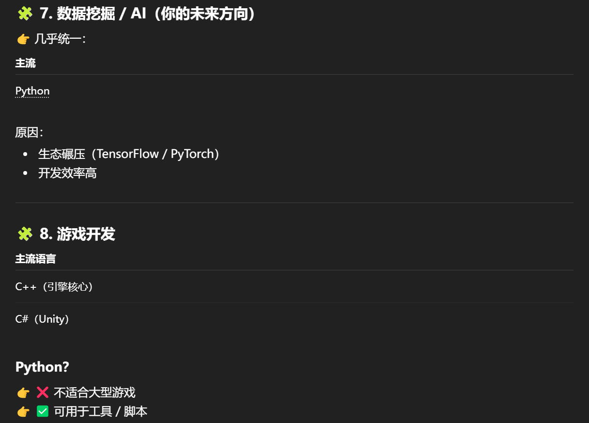

   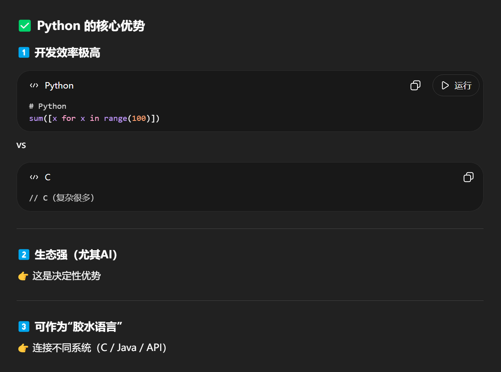

   

   

-----------------------------------------------------------------------------------------------------------------------------------

6. **交互式命令行中输入的命令通常不会生成 `.pyc` 字节码缓存文件，但仍会被编译成内部代码对象/字节码再执行。顶层脚本的执行**（包括但不限于：模块文件图标点击；命令提示符/终端中的<u>标准</u>执行命令；针对模块文件的开始–>运行操作；exec调用；IDLE/IDE等等）**以及Python意图保存字节码但未授权写入的情形下，字节码通常只在内存中生成和销毁，即没有字节码缓存文件的生成。模块导入操作以及模块重新加载操作（在Python拥有写入权限时）可能生成 `.pyc` 字节码缓存文件！源文件的修改、Python版本变化、优化级别变化、缓存失效策略变化等，都可能触发新的字节码缓存生成。**

-----------------------------------------------------------------------------------------------------------------------------------

7. 命令行（最常用的模块执行方法，同时也是最稳定、最不易出错的方法之一；对 `python file.py` 这类顶层脚本执行而言，通常会从当前脚本源文件启动，而不是复用该脚本自身的 `.pyc` 缓存文件。一般用于执行顶层程序文件，不会产出脚本文件自身的字节码缓存文件。此法使用唯一重要的是这是shell环境而不是Python环境！这通常意味着：可以使用shell语法比如对标准流进行控制的操作；严格监测shell语法的使用；遵循shell环境下的对象搜索规则。通常来说，在DOS提示符之后输入的第一个对象若是本机中的对象，那么这意味着计算机假定这个对象是可执行的，实际上，若该对象确实是可执行的.exe程序，那么将被启动，否则会根据文件类型从注册表里找到可以打开它的另一个可执行程序并启动它、在没有注册的情况下发出不是可执行程序的提示或是给出选择一个可执行程序的提示以继续执行，可以说净效果几乎等同于双击对象的图标还有开始–>运行操作；相对的，在类Unix系统的终端中，有些不同之处，首先有个新的概念是可执行权限，赋予该权限一个方法是chmod命令，另一个方法是注册扩展名，前者用于终端中直接执行，而后者除了终端的应用还可以用于图标双击场景，也就是说，计算机仍旧在两种场景下都假定对象可执行，但是这类系统中必须有可执行的权限才能顺利开展下去，Windows则不需要，此外，由于没有注册表的存在，想要像在Windows下那样让一个本质上是文本文件的对象表现为一个可执行程序，需要shebang设置。）

8. 一般来说，Python解释器的部分行为可以通过环境变量设置以及命令行选项来配置：

   * 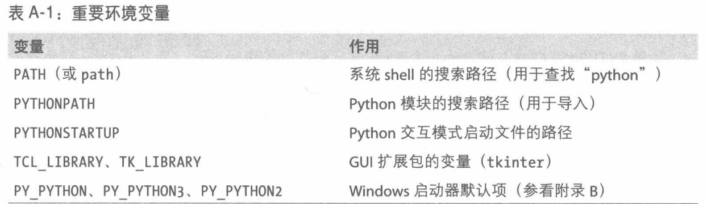

     ```bash
     C:\Windows\System32>py -h
     Python Launcher for Windows Version 3.9.13150.1013
     
     usage:
     py [launcher-args] [python-args] [script [script-args]]
     
     Launcher arguments:
     
     -2     : Launch the latest Python 2.x version
     -3     : Launch the latest Python 3.x version
     -X.Y   : Launch the specified Python version
          The above all default to 64 bit if a matching 64 bit python is present.
     -X.Y-32: Launch the specified 32bit Python version
     -X-32  : Launch the latest 32bit Python X version
     -X.Y-64: Launch the specified 64bit Python version
     -X-64  : Launch the latest 64bit Python X version
     -0  --list       : List the available pythons
     -0p --list-paths : List with paths
     
      If no script is specified the specified interpreter is opened.
     If an exact version is not given, using the latest version can be overridden by
     any of the following, (in priority order):
      An active virtual environment
      A shebang line in the script (if present)
      With -2 or -3 flag a matching PY_PYTHON2 or PY_PYTHON3 Enviroment variable
      A PY_PYTHON Enviroment variable
      From [defaults] in py.ini in your %LOCALAPPDATA%\py.ini
      From [defaults] in py.ini beside py.exe (use `where py` to locate)
     
     The following help text is from Python:
     
     usage: D:\MySoftwareDownload\Python\Python39\python.exe [option] ... [-c cmd | -m mod | file | -] [arg] ...
     Options and arguments (and corresponding environment variables):
     -b     : issue warnings about str(bytes_instance), str(bytearray_instance)
              and comparing bytes/bytearray with str. (-bb: issue errors)
     -B     : don't write .pyc files on import; also PYTHONDONTWRITEBYTECODE=x
     -c cmd : program passed in as string (terminates option list)
     -d     : turn on parser debugging output (for experts only, only works on
              debug builds); also PYTHONDEBUG=x
     -E     : ignore PYTHON* environment variables (such as PYTHONPATH)
     -h     : print this help message and exit (also --help)
     -i     : inspect interactively after running script; forces a prompt even
              if stdin does not appear to be a terminal; also PYTHONINSPECT=x
     -I     : isolate Python from the user's environment (implies -E and -s)
     -m mod : run library module as a script (terminates option list)
     -O     : remove assert and __debug__-dependent statements; add .opt-1 before
              .pyc extension; also PYTHONOPTIMIZE=x
     -OO    : do -O changes and also discard docstrings; add .opt-2 before
              .pyc extension
     -q     : don't print version and copyright messages on interactive startup
     -s     : don't add user site directory to sys.path; also PYTHONNOUSERSITE
     -S     : don't imply 'import site' on initialization
     -u     : force the stdout and stderr streams to be unbuffered;
              this option has no effect on stdin; also PYTHONUNBUFFERED=x
     -v     : verbose (trace import statements); also PYTHONVERBOSE=x
              can be supplied multiple times to increase verbosity
     -V     : print the Python version number and exit (also --version)
              when given twice, print more information about the build
     -W arg : warning control; arg is action:message:category:module:lineno
              also PYTHONWARNINGS=arg
     -x     : skip first line of source, allowing use of non-Unix forms of #!cmd
     -X opt : set implementation-specific option. The following options are available:
     
              -X faulthandler: enable faulthandler
              -X oldparser: enable the traditional LL(1) parser; also PYTHONOLDPARSER
              -X showrefcount: output the total reference count and number of used
                  memory blocks when the program finishes or after each statement in the
                  interactive interpreter. This only works on debug builds
              -X tracemalloc: start tracing Python memory allocations using the
                  tracemalloc module. By default, only the most recent frame is stored in a
                  traceback of a trace. Use -X tracemalloc=NFRAME to start tracing with a
                  traceback limit of NFRAME frames
              -X importtime: show how long each import takes. It shows module name,
                  cumulative time (including nested imports) and self time (excluding
                  nested imports). Note that its output may be broken in multi-threaded
                  application. Typical usage is python3 -X importtime -c 'import asyncio'
              -X dev: enable CPython's "development mode", introducing additional runtime
                  checks which are too expensive to be enabled by default. Effect of the
                  developer mode:
                     * Add default warning filter, as -W default
                     * Install debug hooks on memory allocators: see the PyMem_SetupDebugHooks() C function
                     * Enable the faulthandler module to dump the Python traceback on a crash
                     * Enable asyncio debug mode
                     * Set the dev_mode attribute of sys.flags to True
                     * io.IOBase destructor logs close() exceptions
              -X utf8: enable UTF-8 mode for operating system interfaces, overriding the default
                  locale-aware mode. -X utf8=0 explicitly disables UTF-8 mode (even when it would
                  otherwise activate automatically)
              -X pycache_prefix=PATH: enable writing .pyc files to a parallel tree rooted at the
                  given directory instead of to the code tree
     
     --check-hash-based-pycs always|default|never:
         control how Python invalidates hash-based .pyc files
     file   : program read from script file
     -      : program read from stdin (default; interactive mode if a tty)
     arg ...: arguments passed to program in sys.argv[1:]
     
     Other environment variables:
     PYTHONSTARTUP: file executed on interactive startup (no default)
     PYTHONPATH   : ';'-separated list of directories prefixed to the
                    default module search path.  The result is sys.path.
     PYTHONHOME   : alternate <prefix> directory (or <prefix>;<exec_prefix>).
                    The default module search path uses <prefix>\python{major}{minor}.
     PYTHONPLATLIBDIR : override sys.platlibdir.
     PYTHONCASEOK : ignore case in 'import' statements (Windows).
     PYTHONUTF8: if set to 1, enable the UTF-8 mode.
     PYTHONIOENCODING: Encoding[:errors] used for stdin/stdout/stderr.
     PYTHONFAULTHANDLER: dump the Python traceback on fatal errors.
     PYTHONHASHSEED: if this variable is set to 'random', a random value is used
        to seed the hashes of str and bytes objects.  It can also be set to an
        integer in the range [0,4294967295] to get hash values with a
        predictable seed.
     PYTHONMALLOC: set the Python memory allocators and/or install debug hooks
        on Python memory allocators. Use PYTHONMALLOC=debug to install debug
        hooks.
     PYTHONCOERCECLOCALE: if this variable is set to 0, it disables the locale
        coercion behavior. Use PYTHONCOERCECLOCALE=warn to request display of
        locale coercion and locale compatibility warnings on stderr.
     PYTHONBREAKPOINT: if this variable is set to 0, it disables the default
        debugger. It can be set to the callable of your debugger of choice.
     PYTHONDEVMODE: enable the development mode.
     PYTHONPYCACHEPREFIX: root directory for bytecode cache (pyc) files.
     ```

     通常而言，上面给出的资源已足够使用了，但这里对于命令行参数项还有些补充说明：
     
     首先，Python的sys.argv（一个Python字符串的Python列表）表示**“当前主程序的命令行参数”**，描述的是**“你是如何启动Python的”**，也就是说，它侧重的是Python端的启动机制，这一点直接影响了sys.argv[0]，**sys.argv[0] = 主程序标识**。多数情况下（如：python file.py；python -m file；python -i file.py），主程序就是模块文件。但在某些情况下，主程序并不是模块文件本身（如：python -c "import file" 对应的主程序是 <u>-c 指令</u>；python - < file.py 对应的主程序是<u>标准输入流</u>）。
     
     紧接着，我们对一些相对较为常见的参数做一个简单的介绍：
     
     > 在Python中，- 表示的是从标准输入流读取代码执行
     
     > 在Python中，-c 表示的是从命令行直接执行一段代码（而非执行脚本文件），应用体验和Python的交互式命令行模式类似
     
     > 在Python中，-m 表示的是指定在Python的模块搜索路径上定位一个模块并将其作为顶层脚本来运行（作为模块__main__），也就是说，它不仅是一种顶层脚本执行的方式，更是一种通过切换当前工作目录来执行其它路径下的程序的替代方案，使用时<u>尤其要注意只能提供模块名，不要添加文件后缀</u>
     >
     > 另一方面：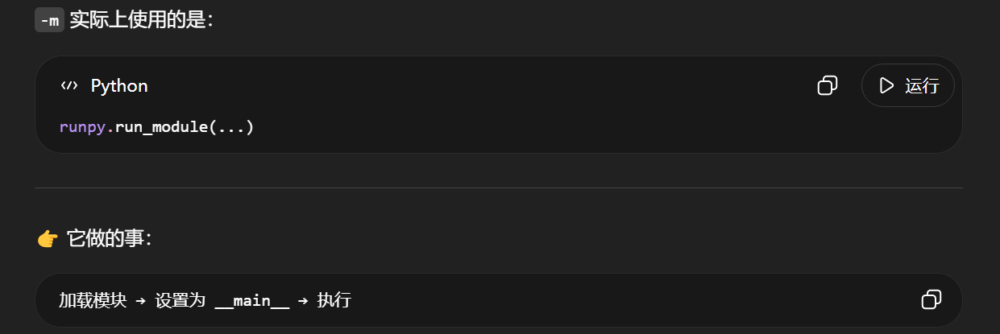
     
     > 在Python中，-O 表示的是以优化模式运行Python，例如：
     >
     > `python -O file.py a b -c  # Optimized: make/run ".pyo" byte code`
     
     > 在Python中，-u 表示的是强制标准流为非缓冲态，即，任何打印的文本将会被立即完成，而不会在缓冲区延迟，例如：
     >
     > `python -u file.py a b -c  # Unbuffered standard output stream`
     
     > 在Python中，-i 表示的是顶级脚本执行后会直接进入一个Python的交互式命令行模式，这可以作为一个很有用的调试工具，用起来给人感觉像是提前在交互式环境下运行了`exec(open('file.py', encoding='utf-8').read())`一样，此时的交互式环境下已存在这个顶级脚本在其顶层定义好的各名称，但是，一定要明确的是：最先开始的是shell环境，Python的交互式环境是其后生成的；更重要的是，虽说看似拥有了访问模块变量名的权限，但这并非“导入操作”，再者，如此打开的交互式环境跳过了常规启动的某些步骤，如：Python每次启动交互模式解释器时都会自动执行PYTHONSTARTUP环境变量（见表A-1）中指定路径下的文件，但仍旧会应用PYTHONPATH环境变量（见表A-1）和.pth文件（若存在）的相关设置
     
     最后：
     
     
     
   * 关于在Python3.3之后新出现的Windows启动器：

      启动器安装后，py.exe程序会在Windows的文件名关联注册表中注册自身为自动打开.py文件的程序。但要注意，`py.exe` 不是另一个Python解释器本体，而是Windows启动器：它负责根据命令行参数、shebang、配置和环境变量等规则选择并启动合适的 `python.exe`。于应用场景的表现上来看，py.exe似乎“架空”了直接调用python.exe的入口（包括但不限于：模块文件的图标点击；针对模块文件的开始–>运行操作；在命令提示符处仅键入模块文件名称的操作等等），python.exe仍旧存在且可用，但是现在需要显式的指明，更有甚者，通常需要设置PATH环境变量（见表A-1）来利于直接在命令提示符处使用某个具体的python.exe，不过现在的py.exe于安装时就自动地装在了操作系统的搜索路径上，以至于在用作命令行时无需目录路径或是PATH设置。

     鉴于启动器在应对多个不同版本的Python共存于同一台机器上的程序执行问题上有着良好的表现，我们不妨展开说说：

     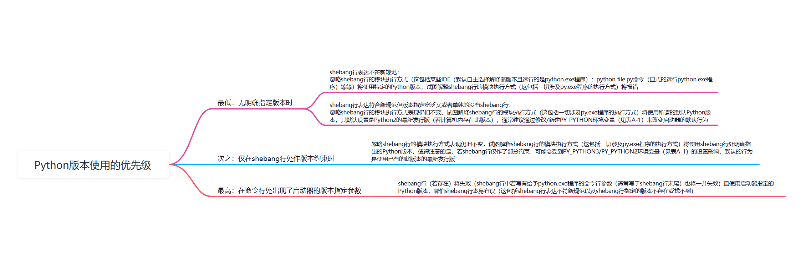

     补充说明：

     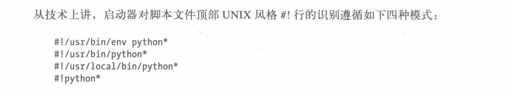

     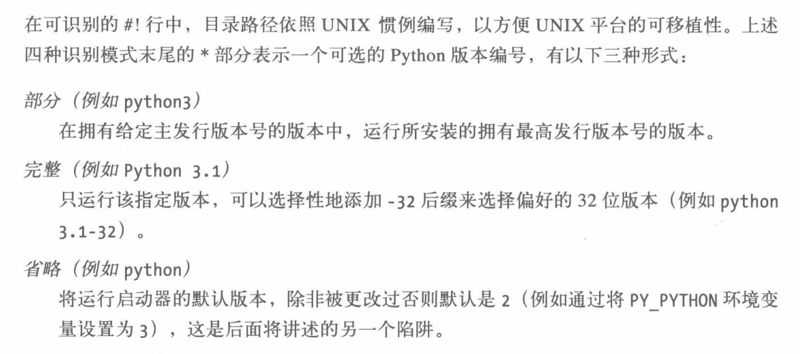

9. **导入操作从本质上来讲，是 import 系统根据模块名完成“查找模块规格、创建或复用模块对象、执行模块代码、缓存模块对象、在当前命名空间绑定名字”的过程。**模块最常见的来源是 `.py` 文件，但并不只限于普通源文件：内置模块、扩展模块、包、zip归档、自定义 finder/loader 都可能参与导入。一个模块的内容通过模块对象的属性被外界使用。

   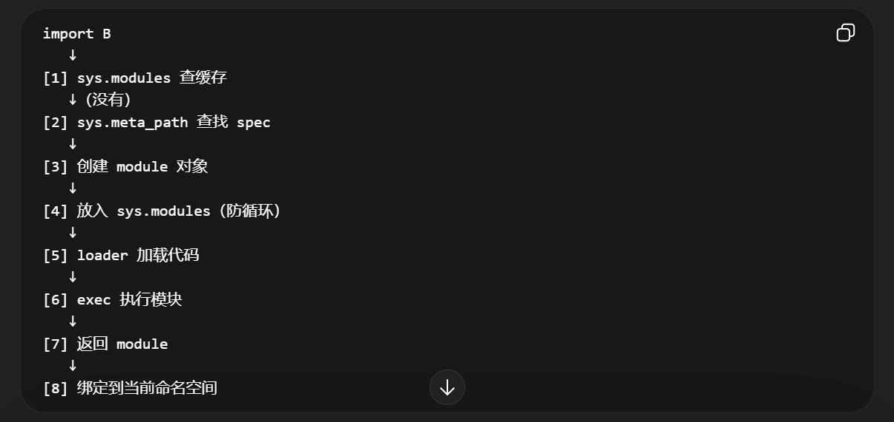

   

   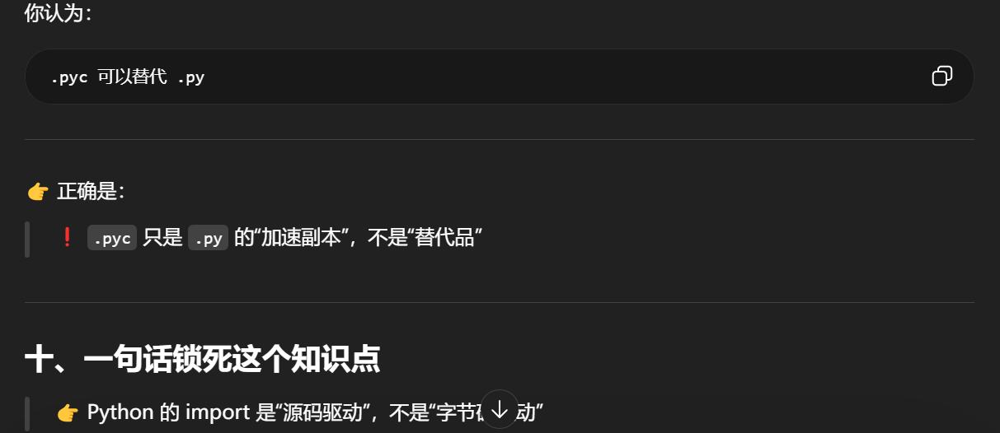

   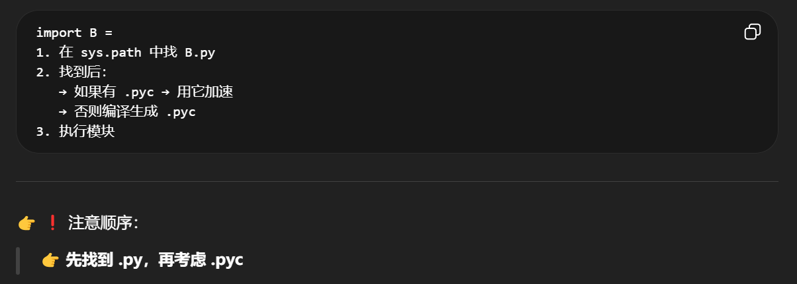

   在此陈述自己对Python导入流程的理解：导入操作发生时，首先会查询 `sys.modules` 是否存在同名键，若存在，则引用现成已加载的模块对象，没有额外的加载执行步骤；不过，要注意引用的是上次导入过的模块对象，因此可能存在代码或数据不同步问题，可以通过 `importlib.reload()` 工具重新执行已导入的模块来解决部分开发期同步问题。若不存在，即当前进程中是首次导入的情形，Python就会使用导入系统来寻找与模块名对应的 module spec；这里要说明的一点是：Python 导入时并不是简单地找 `.py` 文件，而是通过 `sys.meta_path` 上的 finder 机制来寻找符合模块名的 module spec，若查找失败将引发导入错误的异常。在找到模块规格后，通常由对应的 `loader` 创建模块对象并置入 `sys.modules` 中占位，以支持循环导入场景；随后 loader 执行模块代码。若使用源文件加载，解释器可能会检查可用的 `.pyc` 字节码缓存：缓存有效时可以复用，缓存无效或不存在时会重新编译源码，并在允许写入时更新缓存。这里不应理解成“导入过程必定已经生成一个字节码文件”，因为字节码也可能只存在于内存中，或者模块来源根本不是普通 `.py` 文件。最终得到的是一个含有命名空间属性的模块对象（模块执行之后，模块对象的 `__dict__` 就是它的全局命名空间，执行产生的名字会放进模块对象的命名空间），最后在当前作用域中完成名称的绑定操作（可能是模块名，也可能是模块顶层定义的名称）。
   
   【未完待续。。。】

# 练习

1. 人们选择Python的6个主要原因是什么？

   答：**软件质量**（Python从始至终都注重代码的可读性和一致性来确保开发出的软件质量，它们使得Python代码有着比传统脚本语言更优秀的可重用性和可维护性，Python所支持的面向对象以及函数式编程进一步提升了Python代码的可重用性）；**开发效率**（Python简洁易用的语法，动态类型的特征自然而然地缩小了代码的体量；库的支持和无须编译的特点进一步加快了开发速度）；可移植性；库的支持；组件集成以及开发乐趣。

2. 请列举如今正在使用Python的4个著名的公司和组织的名称。

   答：谷歌（Google），工业光魔（Industrial Light & Magic），CCP游戏公司（EVE Online），Maya等。

3. 出于什么样的原因会让你在应用中不使用Python呢？

   答：考虑到Python的核心劣势在于性能偏低，并发能力偏弱以及不适用于底层开发，当应用在这些方面的需求较高时不要使用Python。但在性能这一块，Python支持在特定领域（如：数值处理部分）应用合适的扩展（如C）来改善自身的执行速度。记住：**语言是工具，不是信仰！**

4. 你可以用Python做什么？

   答：从网站和游戏开发到机器人和航天器控制，Python的应用范围几乎覆盖了计算机的方方面面，无非是作用范围和深度等的区别。不过，考虑到Python自身的性能边界与生态优势，Python尤其适合自动化脚本、数据处理、科学计算、AI/机器学习、后端服务、工具链和胶水集成等方向；数据挖掘/AI是非常重要的主战场之一，但不应把Python的工程价值压缩成只有AI。

5. 在Python中 import this 的表述有什么含义？

   答：触发彩蛋：“Python之禅”。内容展示了Python语言层面下的设计哲学，随着对Python的了解越来越深入，会发现它们正被一一印证。

6. 为什么“spam”出现在网上和书中的许多Python例子中？

   答：“spam”引用自Monty Python剧团的其中一部剧，最终结果就是，它成为了Python脚本中的一个常见变量名。

7. 你最喜欢的颜色是什么？

   答：Python官方logo的颜色是蓝色与黄色…

-----------------------------------------------------------------------------------------------------------------------------------

8. 什么是Python解释器？

   答：Python解释器是执行Python程序的程序，它是运行时系统，作用是负责将程序员编写的Python代码解释（翻译）给计算机，**解释器是程序代码和计算机硬件之间的软件逻辑层**。由于Python的实现其重心在于“解释”这一步骤，因而，可以笼统地说，Python的解释器也是Python实现的具象化。<u>Python解释器决定了“代码怎么执行”</u>。

9. 什么是源代码？

   答：程序员按照Python语言规范键入文本文件的内容就是Python源代码。

10. 什么是字节码？

    答：<u>字节码是一种特定于Python的低级且与平台无关的表现形式</u>。Python解释器的首要步骤便是将Python源码编译成字节码，字节码将被虚拟机执行。

11. 什么是PVM？

    答：PVM，即，Python虚拟机（Python Virtual Machine），既是Python系统的一部分，也是Python的运行时引擎，负责将被传入的字节码指令一一解释并执行。在 CPython 语境下，可以近似理解为一个迭代运行字节码指令的解释执行循环。从技术上来说，它是解释器执行阶段的核心部分，<u>它更准确地决定“字节码如何被执行”，而不是决定代码在物理意义上“在哪里执行”</u>。

12. 请列举两个或多个Python标准执行模型的变体的名字。

    答：Jython、IronPython、Stackless、PyPy、Psyco、Shed Skin以及冻结二进制文件都算是Python标准执行模型的变体或相关工具。它们或是替代/改变 CPython 的字节码和虚拟机路线；或是添加强化运行时的工具；或是改变程序分发方式。需要注意，Psyco、Shed Skin 等更多属于特定历史阶段或特定目标下的工具，不应和今天最主流的 CPython/PyPy/Jython/IronPython 等实现并列理解为同等活跃的通用选择。

13. CPython、Jython以及IronPython有什么不同？

    答：CPython是Python的标准实现，而后二者分别是针对Java世界和.Net世界产生的实现变体，但Jython以及IronPython仍旧遵循同一流程：Python源代码–>中间产物–>某种虚拟机执行。

14. 什么是Stackless和PyPy？

    答：Stackless是种增强并发性能的实现变体，PyPy作为Psyco的继任者，融合了Psyco的JIT概念，是针对Python执行速度优化的实现变体。

-----------------------------------------------------------------------------------------------------------------------------------

15. 怎样才能开始一个交互式解释器的会话？

    答：①“开始”菜单选中“Python（command line）”选项；②IDLE启动后的主Python shell窗口以及其它IDE专属的启动方式（如PyCharm的控制台）；③系统终端/命令提示符中键入“python”或是“py”作为命令。

16. 你应该在哪里输入系统命令行来启动一个脚本文件？

    答：你所在平台能够提供给作为系统终端的地方：Windows下的命令提示符；UNIX、Linux或Mac OS X上的xterm/终端窗口等等。

17. 指出运行保存在一个脚本文件中的代码的四种或更多的方法。

    答：①交互式环境下通过exec调用或是os用以模拟系统命令的相关工具；②系统终端/命令提示符中键入形如“python file.py”的命令；③模块文件图标点击；④针对模块文件的开始–>运行操作；⑤IDLE/其它IDE专属的运行模块方法；⑥针对模块文件的导入操作和重新加载操作；⑦某些平台支持更为专用的启动技术（如拖拽和拖放）；⑧某些文本编辑器可以直接运行Python源码；⑨独立的“冻结二进制”可执行文件；⑩其它系统下的嵌入式Python代码。

18. 指出在Windows下点击文件图标运行脚本的两个缺点。

    答：①打印后退出的脚本在这种情形下看不见输出；②脚本可能产生的同样显示在输出窗口的错误信息在这种情形下也看不到。

19. 为什么你需要重载模块？

    答：默认情况下，对于同一个模块，一个Python进程只会导入（加载）一次。因此，若你在不重启Python进程的情形下试图同步这个已导入的模块其源代码的变更，你需要重载该模块。

20. 在IDLE中怎样运行一个脚本？

    答：在目标脚本所在的文件编辑窗口，选择窗口的Run–>Run Module菜单选项。而且在交互式的Python shell窗口将显示目标脚本的输出内容。

21. 列举2个使用IDLE的缺点。

    答：①在IDLE中运行某类程序时会失去响应——尤其是使用多线程的GUI程序（当然，单纯的在IDLE中编辑它们通常没有问题）；②IDLE特有的一些方便的特性（如：IDLE环境下运行的脚本的变量会自动导入至交互作用域中（哪怕脚本没有被导入）；IDLE自动把当前工作目录修改为运行的脚本的所在目录并将其添加到模块导入搜索路径中）在它之外的环境下是没有的，特别是对于初学者，若过分依赖相关特性，将被困扰。

22. 什么是命名空间，它和模块文件有什么关联？

    答：命名空间可以理解为“名称到对象的映射”。在Python中，它常常表现为某个对象携带的一张名字表，例如模块对象的 `__dict__`。一个模块在导入或执行后会拥有自己的全局命名空间，模块顶层的赋值会在这张命名空间字典中建立或更新“名字 -> 对象”的绑定关系。
