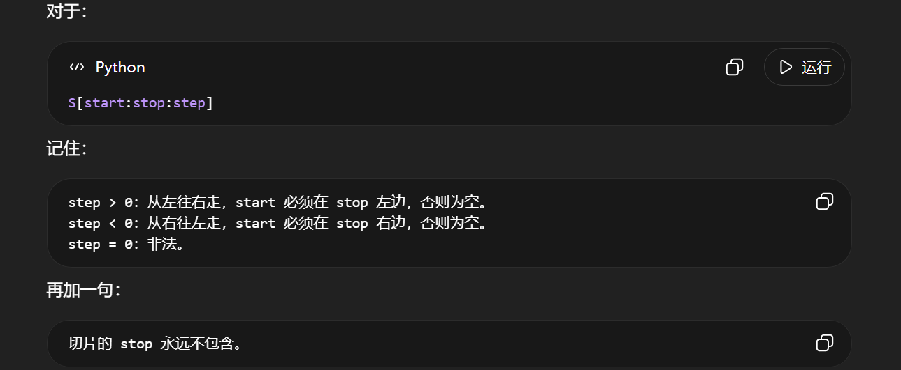

# 思考

1. 在Python中，数据以对象的形式出现，对象表现着数据（对象有时候会被称为数据结构）。按Python程序结构划分，通常会说：表达式创建并处理对象，但千万不要以为Python对象只出现在Python的表达式中，对象也可以被语句创建，甚至，Python的模块和类型都是对象。事实上，<u>在Python中，一切皆对象！</u>而平常见得最多也用得最多的是Python的内置对象，其中有些对象的类型（7+3）：**数字、字符串、列表、元组、字典、集合、文件+类型、None、布尔（型）**，因为各自有专属的特定语法可以生成对应的对象实例，从而被称为**Python的内置核心对象类型**。另外，要知道，Python里没有类型声明的概念，这些内置的核心对象的生成表达式语法就决定了它们的类型，这意味着<u>Python是动态类型的</u>（它自动跟踪你的类型而不是要求声明代码），但同样要记住的是，<u>Python也是强类型语言</u>（即你只能对一个对象进行适合其类型的有效操作）。

2. 从严格意义上来说，Python 3 的 **`str` 是 Unicode 文本序列**：它支持序列协议，按索引取出的结果仍然是一个长度为 1 的 `str`，而不是其它语言里常见的独立 `char` 类型；但这不应该被理解成“字符串内部真的存放着一堆单字符字符串对象”。字符串是一种特殊的序列，同时这种特性导致字符串不可变（Python中对象的`不可变性`指的是对象自创建后不可原地（in place）修改，在核心类型中，数字、字符串和元组是不可变的），就像是数字一样。其它更一般的序列类型还包括<u>列表</u>和<u>元组</u>。而所谓序列，通常认为是一个包含其它对象的有序集合（collection, not set），序列中的元素包含了一个从左至右的顺序——序列中的元素依据各自的相对位置进行存储与读取。序列操作常见的有：索引、分片、拼接、重复。其中，索引是按照从最前面的偏移量进行编码的，也即从0开始，同时Python支持反向索引，也即从最后一个元素（-1）开始，此外，值得注意的是，索引既可以是数字字面量，也可以是变量或是表达式，只要返回的是数字；而从拼接和重复的应用中不难看出：加号（+）/乘号（*）对于不同的对象有不同的意义，这是Python的一般特性：多态，简言之，**一个操作的意义取决于被操作的对象**。最后，序列操作不仅可以应用在所有序列类型对象上，而且其中的拼接、重复、分片这些操作通常会产生新的序列对象作为结果（注意：并非绝对）；但索引只是取出已有元素，不是创建新对象。另外，对不可变序列而言，某些完整分片可能返回原对象本身，这是一种实现优化。

3. 关于分片（slice）操作做了如下的实验：

   ```cmd
   >>> S = 'Spam'
   >>> len(S)
   4
   >>> S[0:len(S)]  # 等价于S[:]，即默认step=1时，默认start是0，默认stop是len(S)，对于列表等可变序列，这种所谓的“完整分片”操作常用于浅拷贝，但对字符串这种不可变对象，则不宜强调“拷贝”
   'Spam'
   >>> S[2:-1]  # 显然，负向索引（负偏移量）允许充当分片边界
   'a'
   >>> S[0:0]  # 起点等于终点时，结果必为空字符串（无论step（非零）具体值为多少）
   ''
   >>> S[0:0] == S[3:3] == S[100:100]  # 起点或终点越界时，分片不会报错（索引越界将报错）；切片会按start、stop、step的方向规则把边界规范化到可处理范围内，这只是切片计算规则，不是修改原来的索引对象
   True
   >>> S[:100] == S[:]  # 在这里，S[:100] 会被自动处理，等价于 S[:4]
   True
   >>> S[0:0] == S[4:5] == S[11:100]  # 在这里，S[4:5] 和 S[11:100] 会被自动处理，都等价于 S[4:4]
   True
   >>> S[3:-2]  # 默认step=1时，若起点在终点右边，则结果必为空字符串
   ''
   >>> S[3:-2] == S[3:-4] == S[3:-1] == S[3:-100] == S[:-100]  # 在这里，S[3:-100] 和 S[:-100] 会被自动处理，分别等价于 S[3:0] 和 S[0:0]
   True
   >>> S[-4:-2]
   'Sp'
   >>> S[-100:-100] == S[-4:-4] == S[-2:-2] == S[-1:-1] == S[0:0] == S[1:1] == S[3:3] == S[100:100]
   True
   >>> S[0:0] == S[-1:-2] == S[-1:-4] == S[-1:-100] == S[:-100] == S[-5:-100] == S[4:-1] == S[4:-4] == S[4:-100] == S[100:-100] == S[100:50]
   True
   >>> S[::2]
   'Sa'
   >>> S[1::2]
   'pm'
   >>> S[::2] == S[0:4:2]
   True
   >>> S[::-1]  # 经典的反转字符串操作
   'mapS'
   >>> S[::-2]
   'mp'
   >>> S[3:0:-1]
   'map'
   >>> S[::0]  # step不得为0，这意味着永远停留在原地，无法推进
   Traceback (most recent call last):
     File "<stdin>", line 1, in <module>
   ValueError: slice step cannot be zero
   ```

   > 切片不是“索引访问”，而是“描述一个区间（生成一个范围），在规范化后（处理可能存在的越界行为），再从序列中取区间和字符串有交集（范围覆盖到）的元素”。

   

4. 关于字符串编程会涉及的转义序列以及新Python的字符串必然触及的领域Unicode：

   > 字符串字面量是“写给 Python 解析器看的源码形式”；字符串对象是“内存中的字符序列”；交互式环境回显的是 `repr()`，不是普通输出。

   ### 4.1 字符串字面量、字符串对象、回显结果不是同一件事

   在交互式环境中输入：

   ```cmd
   >>> spam = 'sp\nm'  # 字符串字面量表达式创建了字符串对象，名称spam引用的是4字符（长度为4）对象 s p \n（换行符） m，要注意：这个对象是不包含引号的，引号是语法而非对象自身的内容
   >>> spam  # 本质是引用，但在当前情景下可以“看作”是个表达式（等价于表达式 'sp\nm'），名称spam所引用的对象在回显时将被repr处理（欲理清其处理过程，须步步推导：1.第一步必须准确无误地判断出：针对的对象究竟是什么样的字符串？含有几个字符？引号是语法还是真实的对象内容，是否存在多种引号嵌套？是否含有转义字符，转义字符合法吗，转义后的字符是引号还是反斜杠还是什么，转义字符可打印吗，反斜杠真的转义了吗，究竟是几根反斜杠？...等等2.代入Python解析器的视角：repr会如何处理可能存在的多种引号，如何处理可能存在的转义字符？上一步的判定直接影响这一步对repr行为的判定3.回显之时：对象交予repr处理，第二步的处理将直接作用在对象的表示上，通常来说，回显结果的长度会比对象本身的长度更大！很重要的一点：这个回显结果一定会在对象表示的首尾添上引号来标记其为字符串，同时，这个额外添加的引号属于对象表示这个字符串的一部分，不能分割看待！莫要混淆“显示文本”和“被显示的对象”！）
   'sp\nm'  # 这个回显文本实质上来自 repr(spam) 的返回值。名称spam引用的对象是 s p \n（换行符） m；repr(spam) 返回一个新的字符串对象，其内容类似 ' s p \ n m '。交互式环境最终显示的是这个返回值的文本表现，不要把“被显示的对象”和“显示出来的文本”混成一层。
   ```

   这里容易误以为字符串中并没有发生换行。实际上，`\n` 已经被 Python 解析器解释成了一个真正的换行字符。

   也就是说：

   ```cmd
   'sp\nm'
   ```

   在源码中看起来包含两个字符：

   ```tex
   反斜杠 + n
   ```

   但字符串对象的真实内容是：

   ```tex
   s
   p
   换行符
   m
   ```

   之所以交互式环境仍然显示：

   ```cmd
   'sp\nm'
   ```

   是因为交互式环境对表达式结果使用的是 `repr()` 风格的回显，而不是 `print()` 风格的输出。

   对比：

   ```cmd
   >>> spam = 'sp\nm'
   >>> spam
   'sp\nm'
   >>> print(spam)
   sp
   m
   ```

   因此要区分：

   ```tex
   源码形式：'sp\nm'
   内存内容：s、p、换行符、m
   回显表示：'sp\nm'  # 千万要分清：回显表示和源码形式虽说看起来一样，但完全不是一回事
   实际打印：sp 换行 m
   ```

   ### 4.2 `str()` 和 `repr()` 的区别

   `str()` 偏向用户友好显示，`repr()` 偏向程序员调试显示。

   ```cmd
   >>> s = 'sp\nm'
   >>> str(s)  # 从回显结果可以反推出来：str(s) 的结果其实就是名称s所指向的字符串对象本身，即，s p \n（换行符） m
   'sp\nm'  # 换言之，直接键入 s 或是 'sp\nm' 并回车执行的回显结果也是一样
   >>> repr(s)  # 这个表达式的实际返回结果是：'sp\nm'（长度为7的字符串对象）
   "'sp\\nm'"  # 倘若repr要处理的字符串对象内容仅含有单引号，则处理后的结果字符串对象是用双引号包裹的，同时原字符串对象中的单引号不会被处理成两个字符——\与'来显示，而是保留；此外，单根反斜杠（一个字符占位）的repr处理通常是两根反斜杠（两个字符占位）
   ```

   这里容易误判。

   `str(s)` 的返回值其实是原字符串本身；交互式环境又对这个返回值做了一次 `repr()`，所以你看到：

   ```cmd
   'sp\nm'
   ```

   而：

   ```cmd
   repr(s)
   ```

   返回的是一个“表示字符串的字符串”，内容类似：

   ```tex
   'sp\nm'
   ```

   这个结果本身再被交互式环境回显时，又会经过一层 `repr()`，所以显示成：

   ```cmd
   "'sp\\nm'"
   ```

   因此：

   ```cmd
   >>> s
   'sp\nm'
   ```

   是一层表示。

   ```cmd
   >>> repr(s)
   "'sp\\nm'"
   ```

   是两层表示。

   可以用 `print()` 看清楚：

   ```cmd
   >>> s = 'sp\nm'
   >>> r = repr(s)  # 名称r指向的字符串对象是 'sp\nm' （7字符），再次强调：这里的r和给名称S赋值时使用的字符串字面量表达式看起来一模一样，但完全不是一回事，后者返回（名称s指向）的字符串对象其实是 sp\nm （4字符）
   >>> print(s)  # print调用隐式的调用了str()，“交给”它打印的是原字符串对象本身 sp\nm （4字符）
   sp
   m
   >>> print(r)  # 同理，这里“交给”它打印的是 'sp\nm' （7字符）
   'sp\nm'
   ```

   还要特别注意：`print(obj)` 会把对象转换成文本并写入输出流，但 `print(...)` 调用本身的返回值是 `None`。所以“被打印的表达式是什么类型”和“`print(...)` 的返回值是什么类型”是两件不同的事。

   ### 4.3 为什么 `\n` 显示成 `\n`，而 `\a` 显示成 `\x07`

   例如：

   ```cmd
   >>> 'sp\nm'  # 表达式返回结果是长度为4的字符串对象
   'sp\nm'  # 但是经过repr处理后，回显的结果字符串对象长度变为了7
   >>> 'sp\am'  # 表达式返回结果是长度为4的字符串对象
   'sp\x07m'  # 但是经过repr处理后，回显的结果字符串对象长度变为了9
   ```

   `\n` 和 `\a` 都是合法转义序列。

   其中：

   ```tex
   \n  表示换行符，码位是 10，也就是十六进制 0x0A
   \a  表示响铃字符 BEL，码位是 7，也就是十六进制 0x07
   ```

   Python 的 `repr()` 不保证按照用户输入时的原始写法显示字符串。它只负责生成一个<u>清晰</u>、<u>可读</u>、<u>可再解释</u>的表示形式。

   对于常见控制字符，`repr()` 通常使用短转义形式：

   ```cmd
   '\n'
   '\t'
   '\r'
   ```

   对于不常用或不适合直接显示的控制字符，常使用十六进制形式：

   ```cmd
   '\x07'
   '\x00'
   '\x01'
   ```

   所以：

   ```cmd
   '\a' == '\x07'
   ```

   结果是：

   ```cmd
   True
   ```

   二者代表同一个字符，只是写法不同。

   ### 4.4 `\c` 为什么显示成 `\\c`

   例如：

   ```cmd
   >>> 'sp\cm'  # 注意：这里的 \c 不是Python认可的标准转义序列；在Python 3.9中，反斜杠会作为真实字符保留下来，这个表达式返回的字符串对象长度为5
   'sp\\cm'  # 这是交互式环境的repr风格显示文本；显示中的两根反斜杠用于表示对象里那一个真实反斜杠字符，不要把显示文本长度和对象长度混为一谈
   ```

   在 Python 3.9 中，`\c` 不是 Python 认可的标准转义序列。因此这个字符串的真实内容中保留了两个普通字符：

   ```tex
   反斜杠
   c
   ```

   交互式环境回显时，为了让你看出字符串中真的存在一个反斜杠，就把反斜杠显示为：

   ```cmd
   \\
   ```

   所以结果显示为：

   ```cmd
   'sp\\cm'
   ```

   注意：

   ```cmd
   'sp\\cm'
   ```

   在源码中表示的真实内容是：

   ```tex
   sp\cm
   ```

   也就是只有一个反斜杠。

   不过，工程中不推荐依赖这种“非标准转义被保留”的写法。Python 3.9 中它通常还能工作，但可能出现警告；后续版本对无效转义的提醒更明显。若你的意图就是写一个真实反斜杠，应优先使用 `\\`，或在适合的路径/正则场景中使用原始字符串。

   ### 4.5 `\0`、`\x00` 与空字符

   例如：

   ```cmd
   >>> 'A\0B\0C'
   'A\x00B\x00C'
   ```

   `\0` 是合法转义序列，表示空字符 NUL，码位是：

   ```tex
   0
   ```

   十六进制写作：

   ```tex
   0x00
   ```

   所以：

   ```cmd
   '\0' == '\x00'
   ```

   结果是：

   ```cmd
   True
   ```

   `\0` 可以看作八进制转义的一种简写。

   例如：

   ```cmd
   '\0'      # 空字符，码位 0
   '\07'     # 响铃字符，码位 7
   '\101'    # 字符 A，因为八进制 101 等于十进制 65
   ```

   现代 Python 代码中，若要表达不可见控制字符，更推荐使用较清晰的十六进制或 Unicode 写法：

   ```cmd
   '\x00'
   '\u0000'
   ```

   ### 4.6 常见转义序列

   常见转义序列包括：

   ```cmd
   '\n'        # 换行
   '\t'        # 水平制表符
   '\r'        # 回车
   '\\'        # 一个反斜杠（仅占用一个字符位，但是要记住：通常repr针对这个转义序列采用的显示也是两根反斜杠，但是占位是两个字符位）
   '\''        # 一个单引号（仅占用一个字符位，但是要记住：通常repr针对这个转义序列采用的显示也是单根反斜杠加上一个单引号，但是占位是两个字符位）
   "\""        # 一个双引号
   '\a'        # 响铃字符
   '\b'        # 退格
   '\f'        # 换页
   '\v'        # 垂直制表
   '\ooo'      # 八进制转义
   '\xhh'      # 两位十六进制转义（即，若在字符串对象生成的字面量表达式中出现，则说明发生了转义且仅占用一个字符位，要把这里的转义操作和repr针对某些转义序列进行的十六进制形式显示区别开来）
   '\uxxxx'    # 四位十六进制 Unicode 转义
   '\Uxxxxxxxx' # 八位十六进制 Unicode 转义
   ```

   例如：

   ```cmd
   '\x41'        # 'A'
   '\u0041'      # 'A'
   '\u4e2d'      # '中'
   '\U0001F600'  # '😀'
   ```

   ### 4.7 Unicode、字符、码位

   Unicode 可以理解为一套统一的字符编号标准。

   它给字符分配编号，这个编号通常称为码位。

   例如：

   ```tex
   A   -> U+0041  # 65
   Ä   -> U+00C4  # 196
   中  -> U+4E2D  # 20013
   😀  -> U+1F600  # 128512
   ```

   在 Python 3 中，普通字符串 `str` 就是 Unicode 字符串。

   但还要注意一层细节：`len(s)` 统计的是 Python 字符串序列中的元素数量，通常可以理解为 Unicode 码位数量；它不等于 UTF-8 字节数，也不一定等于用户肉眼看到的“一个字符”。例如某些组合音标或 emoji 序列，在视觉上可能像一个字符，但底层可能由多个码位组成。

   ```cmd
   >>> type('abc')
   <class 'str'>
   >>> type('中')
   <class 'str'>
   ```

   也就是说，Python 3 中：

   ```cmd
   'abc'
   ```

   和：

   ```cmd
   u'abc'
   ```

   都属于 `str` 字符串。

   `u'...'` 主要是为了兼容 Python 2 风格代码。

   ### 4.8 ASCII 与 Unicode 的关系

   ASCII 是早期字符编码标准，只覆盖 128 个字符，包括英文字母、数字、常见标点和控制字符。

   Unicode 兼容 ASCII 的前 128 个码位。

   例如：

   ```tex
   ASCII 中的 A       -> 65
   Unicode 中的 A     -> U+0041
   UTF-8 编码后的 A   -> 0x41
   ```

   因此可以粗略地说：

   > ASCII 文本可以看作 Unicode 文本的一个简单子集。

   但严格说，ASCII、Unicode、UTF-8 不是同一层概念：

   ```tex
   ASCII：早期字符集/编码标准
   Unicode：统一字符编号标准
   UTF-8：Unicode 的一种编码方式
   ```

   ### 4.9 `\xc4` 与 `\u00c4`

   例如：

   ```cmd
   >>> 'sp\xc4m'
   'spÄm'
   >>> u'sp\u00c4m'
   'spÄm'
   ```

   原因是：

   ```cmd
   '\xc4'
   ```

   在 Python 3 的 `str` 字符串中表示 Unicode 码位：

   ```tex
   U+00C4
   ```

   而：

   ```cmd
   '\u00c4'
   ```

   同样表示 Unicode 码位：

   ```tex
   U+00C4
   ```

   该码位对应字符：

   ```tex
   Ä
   ```

   所以：

   ```cmd
   'sp\xc4m' == u'sp\u00c4m'
   ```

   结果是：

   ```cmd
   True
   ```

   另外：

   ```cmd
   '\xc4' == '\xC4'
   ```

   结果也是：

   ```cmd
   True
   ```

   十六进制大小写不敏感。

   ### 4.10 字节、字符、`str`、`bytes`

   字符是文本层面的单位，例如：

   ```tex
   A
   中
   Ä
   😀
   ```

   字节是存储和传输层面的单位，一个字节通常是 8 位，取值范围是：

   ```tex
   0 ~ 255
   ```

   十六进制表示为：

   ```tex
   0x00 ~ 0xFF
   ```

   在 Python 3 中：

   ```cmd
   str
   ```

   表示 **Unicode 字符序列**。

   ```cmd
   bytes
   ```

   表示**原始字节序列**。

   例如：

   ```cmd
   >>> s = '中'
   >>> type(s)
   <class 'str'>
   >>> b = s.encode('utf-8')
   >>> b
   b'\xe4\xb8\xad'
   >>> type(b)
   <class 'bytes'>
   ```

   二者关系是：

   ```tex
   str --encode()--> bytes
   bytes --decode()--> str
   ```

   也就是：

   ```cmd
   >>> '中'.encode('utf-8')
   b'\xe4\xb8\xad'

   >>> b'\xe4\xb8\xad'.decode('utf-8')
   '中'
   ```

   `bytes` 的显示也会使用转义。比如：

   ```cmd
   >>> b'A\\nB'
   b'A\\nB'
   ```

   这里显示出来的 `\\` 是为了表示一个真实的反斜杠字节（数值 92），并不意味着原始字节序列里有两个反斜杠字节。要判断真实字节，优先看 `list(b)` 或 `b.hex()`。

   ### 4.11 `'\xc4'` 和 `b'\xc4'` 不是一回事

   这是非常容易混淆的地方。

   ```cmd
   '\xc4'
   ```

   是 `str`，表示一个 Unicode 字符：

   ```tex
   Ä
   ```

   而：

   ```cmd
   b'\xc4'
   ```

   是 `bytes`，表示一个原始字节，数值为：

   ```tex
   196
   ```

   所以：

   ```cmd
   '\xc4' == b'\xc4'
   ```

   结果是：

   ```cmd
   False
   ```

   再看：

   ```cmd
   >>> 'Ä'.encode('utf-8')
   b'\xc3\x84'
   ```

   字符 `Ä` 的 Unicode 码位是：

   ```tex
   U+00C4
   ```

   但它的 UTF-8 编码结果是两个字节：

   ```tex
   C3 84
   ```

   因此必须区分三层：

   ```tex
   字符：Ä
   Unicode 码位：U+00C4
   UTF-8 字节：C3 84
   ```

   ### 4.12 `ord()` 与 `chr()`

   `ord()` 用于把单个字符转换成 Unicode 码位编号。

   ```cmd
   >>> ord('A')
   65
   >>> ord('中')
   20013
   >>> hex(ord('中'))
   '0x4e2d'
   ```

   `chr()` 用于把码位编号转换成字符。

   ```cmd
   >>> chr(65)
   'A'
   >>> chr(0x4e2d)
   '中'
   ```

   可以记为：

   ```tex
   ord: 字符 -> 编号
   chr: 编号 -> 字符
   ```

   ### 4.13 编码与解码

   编码和解码的本质是：

   ```tex
   编码 encode：字符序列 -> 字节序列
   解码 decode：字节序列 -> 字符序列
   ```

   在 Python 3 中对应为：

   ```tex
   str.encode()   -> bytes
   bytes.decode() -> str
   ```

   例如：

   ```cmd
   >>> s = '中文'
   >>> b = s.encode('utf-8')
   >>> b
   b'\xe4\xb8\xad\xe6\x96\x87'
   >>> b.decode('utf-8')
   '中文'
   ```

   文本文件、网络传输、数据库存储，本质上都离不开这个过程。

   ### 4.14 UTF-8 与 UTF-16

   UTF-8 和 UTF-16 都是 Unicode 的编码方式。

   UTF-8 的特点：

   ```tex
   兼容 ASCII
   英文通常占 1 字节
   中文通常占 3 字节
   emoji 通常占 4 字节
   Web、Linux、文本文件、网络协议中非常常见
   ```

   UTF-16 的特点：

   ```tex
   常用 2 字节或 4 字节表示字符
   和 Windows、Java、JavaScript 的历史实现关系较深
   可能涉及字节序问题
   ```

   UTF-8 更常见的原因主要是：

   ```tex
   兼容 ASCII
   空间利用较适合英文和混合文本
   网络和 Web 生态广泛采用
   较少直接暴露字节序问题
   ```

   ### 4.15 从输入 `'spam'` 到看到回显，发生了什么

   在交互式环境中输入：

   ```cmd
   'spam'
   ```

   并按下回车后，大致过程是：

   ```tex
   键盘输入字符
   ↓
   编辑器/终端把输入内容交给 Python
   ↓
   Python 解析源码文本
   ↓
   识别字符串字面量
   ↓
   创建 str 对象，内容为 s、p、a、m
   ↓
   交互式环境对结果调用 repr()
   ↓
   得到 'spam' 这种代码式表示
   ↓
   显示到控制台
   ```

   如果输入：

   ```cmd
   'sp\nm'
   ```

   则过程是：

   ```tex
   源码中出现反斜杠+n
   ↓
   Python 解析字符串字面量
   ↓
   把 \n 转换成真正的换行字符
   ↓
   创建 str 对象：s、p、换行符、m
   ↓
   交互式环境调用 repr()
   ↓
   为了避免真实换行造成误判，显示为 'sp\nm'
   ```

   ### 4.16 文本文件中的编解码

   内存中的 Python 字符串是 `str`，但文件中保存的是字节。

   写入文件时：

   ```python
   text = '中'

   with open('demo.txt', 'w', encoding='utf-8') as f:
       f.write(text)
   ```

   过程是：

   ```tex
   Python str：'中'
   ↓ encode('utf-8')
   字节：e4 b8 ad
   ↓
   写入文件
   ```

   读取文件时：

   ```python
   with open('demo.txt', 'r', encoding='utf-8') as f:
       text = f.read()
   ```

   过程是：

   ```tex
   从文件读取字节：e4 b8 ad
   ↓ decode('utf-8')
   Python str：'中'
   ```

   所以文本文件的关键原则是：

   > 用什么编码写入，原则上就应该用什么编码读取。

   ### 4.17 总结模型

   可以把字符串、转义、Unicode、bytes、编解码压缩成这张图：

   ```tex
   源码中的字符串字面量
           ↓ Python 解析转义序列
   内存中的 str 对象
           ↓ encode(encoding)
   bytes 字节序列
           ↓ 写入文件 / 网络传输 / 二进制存储
   外部世界中的字节
           ↓ decode(encoding)
   内存中的 str 对象
   ```

   最终要记住：

   > **Python 3 的 `str` 是 Unicode 字符序列；`bytes` 是原始字节序列；编码把 `str` 变成 `bytes`；解码把 `bytes` 变成 `str`；反斜杠转义发生在字符串字面量解析阶段；交互式环境回显发生在表达式求值之后。**

5. 关于Python的组包（packing）和解包（unpacking）：

   > Python 经常把“多个对象”临时组织成一个整体；也经常把一个整体拆开分发到多个位置。前者可称为组包，后者可称为解包。

   首先来个总览：

   组包就是：

   > 把多个值收集成一个容器对象。

   <u>最常见</u>（意即并非唯一形式）的是元组组包：

   ```cmd
   x = 1, 2, 3
   ```

   等价于：

   ```cmd
   x = (1, 2, 3)
   ```

   所以：

   ```cmd
   >>> x
   (1, 2, 3)
   ```

   注意，真正制造元组的不是圆括号，而是逗号。

   ```cmd
   x = 1,
   ```

   结果是：

   ```cmd
   (1,)
   ```

   而：

   ```cmd
   x = (1)
   ```

   结果是：

   ```cmd
   1
   ```

   而解包就是：

   > 把一个<u>**可迭代对象**</u>（不一定是序列，但一定是可迭代对象）中的元素拆开，分别绑定到多个目标上。

   例如：

   ```cmd
   a, b, c = [1, 2, 3]
   ```

   等价于：

   ```tex
   从右边可迭代对象中依次取出 1、2、3
   分别绑定给 a、b、c
   ```

   结果：

   ```cmd
   a == 1
   b == 2
   c == 3
   ```

   右边不一定是元组，也可以是任何可迭代对象：

   ```cmd
   a, b, c = "abc"
   ```

   得到：

   ```cmd
   a = 'a'
   b = 'b'
   c = 'c'
   ```

   下面介绍相对来说较为常见的组包/解包场合：

   * 赋值中的组包与解包

     *  常规多目标赋值

       ```cmd
       a, b = 1, 2
       ```

       右边先组包成类似：

       ```cmd
       (1, 2)
       ```

       然后左边解包。

       结果：

       ```cmd
       a = 1
       b = 2
       ```

       所以：

       ```cmd
       a, b = b, a
       ```

       可以安全交换变量（在某些其它编程语言中需要借助第三个“中间变量”）。

       过程是：

       ```tex
       右边先求值并组包成临时元组
       再解包给左边
       ```

     * 数量必须匹配

       ```cmd
       a, b = [1, 2, 3]
       ```

       会报错：

       ```cmd
       ValueError: too many values to unpack
       ```

       因为左边需要 2 个值，右边有 3 个。

       ```cmd
       a, b, c = [1, 2]
       ```

       也会报错：

       ```cmd
       ValueError: not enough values to unpack
       ```

     * 星号收集：扩展解包

       ```cmd
       a, *b = [1, 2, 3, 4]  # 注意：形如：*b 和 *(a, b) 的形式单独出现在赋值号左侧是非法的：SyntaxError: starred assignment target must be in a list or tuple；此外，星号表达式出现在赋值号左侧最多仅能存在一个，否则：SyntaxError: multiple starred expressions in assignment，相对的，出现在赋值号右侧星号表达式可以存在多个，但是无论此时有多少个星号表达式，都要求被“包含”在合适的容器对象内，否则，可能抛出异常：SyntaxError: can't use starred expression here
       ```

       结果：

       ```cmd
       a = 1
       b = [2, 3, 4]
       ```

       **注意：赋值语句中的 `*b` 收集结果是列表（无论组包的类型是否是列表），不是元组（函数定义中与之类似的位置参数收集的结果是元组而不是列表）**。

       ```cmd
       *a, b = [1, 2, 3, 4]
       ```

       结果：

       ```cmd
       a = [1, 2, 3]
       b = 4
       ```

       ```cmd
       a, *b, c = [1, 2, 3, 4]  # 可用“中间部分被收集起来”作直觉类比；但严格说，扩展解包按迭代协议取值，星号目标会把剩余对应项收集成一个新的列表，并不要求右侧对象真的支持切片
       ```

       结果：

       ```cmd
       a = 1
       b = [2, 3]
       c = 4
       ```

     * 嵌套解包

       ```cmd
       a, (b, c) = [1, (2, 3)]
       ```

       结果：

       ```cmd
       a = 1
       b = 2
       c = 3
       ```

       也可以这样：

       ```cmd
       records = [('Tom', 18), ('Jack', 20)]

       for name, age in records:
           print(name, age)
       ```

       这里 `for` 循环每次取出一个二元组，然后解包给 `name, age`。

   * 函数返回值中的组包/解包

     函数返回多个值，本质上通常是返回一个元组。

     ```python
     def f():
         return 1, 2, 3
     ```

     等价于：

     ```python
     def f():
         return (1, 2, 3)
     ```

     调用：

     ```python
     x = f()
     ```

     得到：

     ```python
     x = (1, 2, 3)
     ```

     也可以直接解包：

     ```python
     a, b, c = f()
     ```

   * 函数调用中的解包

     * `*iterable`：位置参数解包

       ```python
       args = [1, 2, 3]

       print(*args)
       ```

       等价于：

       ```python
       print(1, 2, 3)
       ```

       也就是说：

       ```python
       *args
       ```

       **在函数调用现场会把<u>一个可迭代对象</u>（也就是说，不论是Python自动隐式的解包又或是用户手动显式的解包都要求针对的是可迭代对象）拆开，作为多个位置参数传入**。

     * `**mapping`：关键字参数解包

       ```python
       kwargs = {'sep': '-', 'end': '!\n'}

       print('a', 'b', 'c', **kwargs)
       ```

       等价于：

       ```python
       print('a', 'b', 'c', sep='-', end='!\n')
       ```

       输出：

       ```tex
       a-b-c!
       ```

       **函数调用中的 `**` 要求对象是<u>映射</u>，通常是字典；键必须是字符串。若目标函数有显式形参，键还需要能匹配对应参数名；若目标函数只用 `**kwargs` 收集，多数普通字符串键也可以进入 `kwargs` 字典。**

   * 函数定义中的组包

     **函数定义里的 `*args` 和调用里的 `*args` 方向正好相反**。

     * 定义时的 `*args` ：收集位置参数

       ```python
       def f(*args):
           print(args)

       f(1, 2, 3)
       ```

       输出：

       ```python
       (1, 2, 3)
       ```

       **这里 `*args` 是组包，把多个位置参数收集成一个<u>元组</u>**。

     * 定义时的 `**kwargs` ：收集关键字参数

       ```python
       def f(**kwargs):
           print(kwargs)

       f(a=1, b=2)
       ```

       输出：

       ```python
       {'a': 1, 'b': 2}
       ```

       **这里 `**kwargs` 把多个关键字参数收集成一个<u>字典</u>**。

     * 定义和调用方向相反

       非常重要：

       ```python
       def f(*args):
           ...
       ```

       定义时：`*args` 是**组包**。

       ```python
       f(*args)
       ```

       调用时：`*args` 是**解包**。

       同理：

       ```python
       def f(**kwargs):
           ...
       ```

       定义时：`**kwargs` 是**组包**。

       ```python
       f(**kwargs)
       ```

       调用时：`**kwargs` 是**解包**。

   * 其它常见的解包场合

     * 列表、元组、集合字面量中的解包

       ```cmd
       a = [1, 2]
       b = [3, 4]

       c = [*a, *b, 5]
       ```

       结果：

       ```cmd
       [1, 2, 3, 4, 5]
       ```

       元组也可以：

       ```cmd
       t = (*a, *b)
       ```

       结果：

       ```cmd
       (1, 2, 3, 4)  # 这里的*a和*b是在元组字面量中展开元素；若只是把单个可迭代对象转成元组，tuple(a)更清晰
       ```

       集合也可以：

       ```cmd
       s = {*a, *b}
       ```

       结果：

       ```cmd
       {1, 2, 3, 4}  # 这里的*a和*b是在集合字面量中展开元素；若只是把单个可迭代对象转成集合，set(a)更清晰
       ```

     * 字典字面量中的`**`

       ```cmd
       d1 = {'a': 1}
       d2 = {'b': 2}

       d = {**d1, **d2, 'c': 3}  # 这是字典字面量中的映射解包：把d1、d2中的键值对合并进新字典，若key重复，后面的覆盖前面的。它和函数调用里的dict(**d1, **d2)长得像，但边界不同：dict(**mapping)属于关键字参数解包，key必须是字符串，重复关键字还可能报错；而字典字面量的{**mapping}可以处理非字符串key，并按字面量合并规则覆盖重复key。此外，(*a,)跟tuple(*a)并不等价，通常应比较的是(*a,) == tuple(a)
       ```

       结果：

       ```cmd
       {'a': 1, 'b': 2, 'c': 3}
       ```

       如果 key 重复，后面的覆盖前面的：

       ```cmd
       d = {**{'a': 1}, **{'a': 99}}
       ```

       结果：

       ```cmd
       {'a': 99}
       ```

6. 关于Python动态类型机制的阶段性总结：

   > 动态类型不是“没有类型”，而是“类型属于对象，而不是属于变量名”；Python运行时会根据对象本身支持的操作协议来决定一段操作是否有效、具体如何执行。

   ### 6.1 名字、对象、引用、绑定

   在Python中，变量名不是装值的盒子，而是绑定到对象的名字。赋值语句的本质不是把对象“复制进变量”，而是建立或改变“名字 --> 对象”的绑定关系。

   ```python
   x = 10
   x = "hello"
   x = [1, 2, 3]
   ```

   表面上看，`x` 的类型不断变化；本质上说，`x` 这个名字先后绑定到了整数对象、字符串对象和列表对象。也就是说，`type(x)` 查看的是 `x` 当前绑定对象的类型，而不是“变量x自身的类型”。

   非常重要：

   ```tex
   名字不是对象。
   名字可以重新绑定。
   对象可以被多个名字同时引用。
   ```

   因此：

   ```python
   a = [1, 2]
   b = a
   b.append(3)
   ```

   这里不是 `b` 修改了 `a`，而是 `a` 和 `b` 绑定到同一个列表对象，`append` 修改的是这个共享的列表对象。

   常见误区：

   ```tex
   误区1：变量有固定类型。
   修正：对象有类型，名字没有固定类型。

   误区2：b = a 会复制对象。
   修正：b = a 只是让 b 绑定到 a 当前绑定的同一个对象。
   ```

   ### 6.2 可变对象、不可变对象与重新绑定

   Python对象的“可变性”指的是对象创建后，能否在原地（in place）修改自身内容。列表、字典、集合等对象通常是可变对象；数字、字符串、元组等对象通常是不可变对象。

   ```python
   xs = [1, 2]
   xs.append(3)   # 原地修改列表对象

   s = "py"
   s = s + "thon" # 创建新字符串对象，再让 s 重新绑定
   ```

   **原地修改对象**和**重新绑定名字**是两件不同的事。对可变对象而言，`append`、`extend`、`dict[key] = value`、`clear` 等操作通常会改变对象本身；对不可变对象而言，看似修改的操作通常只能产生新对象，再让名字重新绑定。

   `+=` 是一个尤其容易误判的地方：

   ```python
   a = [1, 2]
   b = a
   b += [3]
   print(a)      # [1, 2, 3]
   print(a is b) # True
   ```

   对列表来说，`+=` 通常表现为原地扩展；但对字符串来说：

   ```python
   a = "py"
   b = a
   b += "thon"
   print(a)      # py
   print(b)      # python
   print(a is b) # False
   ```

   这是因为字符串不可变，无法原地增长，只能得到新字符串对象并重新绑定 `b`。

   ### 6.3 浅拷贝、深拷贝与嵌套对象共享

   浅拷贝会创建新的外层容器，但外层容器里的元素仍然引用原来的对象。

   ```python
   a = [[1], [2]]
   b = a.copy()

   b.append([3])     # 只修改 b 的外层列表
   b[0].append(99)   # 修改的是 a 与 b 共享的内层列表
   ```

   因此，浅拷贝不是“完全隔离”。它的模型更接近：

   ```tex
   a -> 外层列表A -> 内层列表X, 内层列表Y
   b -> 外层列表B -> 内层列表X, 内层列表Y
   ```

   如果希望内层对象也独立，才考虑 `copy.deepcopy()`：

   ```python
   import copy

   a = [[1], [2]]
   b = copy.deepcopy(a)
   b[0].append(99)
   ```

   深拷贝不应被机械地当作“更高级的拷贝”。工程实践中要判断哪些层需要独立，哪些层允许共享；否则可能引入不必要的性能成本，甚至错误复制文件句柄、连接、锁等不适合复制的对象。

   常见误区：

   ```tex
   误区：a.copy() 会让所有层级完全独立。
   修正：浅拷贝只复制外层容器，内层可变对象仍可能共享。
   ```

   ### 6.4 函数参数传递：形参名绑定到实参对象

   Python函数调用不宜简单说成“传值”或“传引用”。更准确的说法是：函数调用时，形参名会绑定到实参对象。

   ```python
   def change(xs):
       xs.append(3)

   a = [1, 2]
   change(a)
   print(a)  # [1, 2, 3]
   ```

   这里的过程是：

   ```tex
   外部名字 a 绑定到列表对象。
   调用函数时，局部名字 xs 也绑定到这个列表对象。
   xs.append(3) 修改的是列表对象本身。
   函数结束后 xs 消失，但 a 仍然引用这个列表对象。
   ```

   但如果函数内部重新绑定形参名：

   ```python
   def reset(xs):
       xs = []

   a = [1, 2, 3]
   reset(a)
   print(a)  # [1, 2, 3]
   ```

   `xs = []` 只是让局部名字 `xs` 绑定到一个新列表，既没有修改原列表，也没有改变外部名字 `a` 的绑定。若要清空传入的列表对象，应使用：

   ```python
   def reset(xs):
       xs.clear()
   ```

   常见误区：

   ```tex
   误区：xs = [] 能清空调用者传入的列表。
   修正：赋值只重新绑定局部名字；clear 才是修改列表对象本身。
   ```

   ### 6.5 默认参数、闭包与对象生命周期

   对象是否存活，不取决于它最初在哪里创建，也不取决于函数是否已经执行结束，而取决于是否仍有地方引用它。

   默认参数的经典陷阱：

   ```python
   def add_item(x, items=[]):
       items.append(x)
       return items
   ```

   默认参数 `[]` 不是每次调用都创建一次，而是在执行 `def` 语句、创建函数对象时创建一次，并保存在函数对象的 `__defaults__` 中。

   ```python
   print(add_item.__defaults__)
   print(id(add_item.__defaults__[0]))
   ```

   因此，函数调用结束后，局部名字 `items` 确实消失了，但默认列表对象仍被 `add_item.__defaults__` 引用，所以继续存活。

   正确的常见写法是：

   ```python
   def add_item(x, items=None):
       if items is None:
           items = []
       items.append(x)
       return items
   ```

   闭包也是对象生命周期的边界案例：

   ```python
   def outer():
       data = []

       def inner(x):
           data.append(x)
           return data

       return inner

   f = outer()
   ```

   `outer()` 执行结束后，`data` 对象仍然可能存活，因为 `inner` 函数对象通过闭包继续引用它，而外部名字 `f` 又引用着 `inner`。

   ```tex
   f -> inner函数对象 -> __closure__ -> cell -> data所绑定的列表对象
   ```

   这和默认参数共同说明：函数结束不代表相关对象必定死亡。名字消失不等于对象消失；对象只要还能被某处引用，就会继续存活。

   ### 6.6 `is`、`==` 与 `id()`

   `is` 比较对象身份，`==` 比较对象相等，`id()` 用来观察对象在当前生命周期内的身份标识。

   ```python
   a = [1, 2]
   b = a
   c = [1, 2]

   print(a is b) # True
   print(a == b) # True
   print(a is c) # False
   print(a == c) # True
   ```

   `is` 的问题是“是不是同一个对象”；`==` 的问题是“内容或业务意义上是否相等”。`==` 的行为可以被类型通过 `__eq__` 定义，但 `is` 的对象身份判断不能被重载。

   `id()` 很适合学习阶段观察对象关系，尤其是验证共享引用、浅拷贝和深拷贝；但正式业务逻辑通常不应依赖 `id()`，因为它只在当前进程、当前对象生命周期内有意义，而且对象销毁后标识可能被复用。

   常见误区：

   ```tex
   误区：用 is 比较普通数字或字符串。
   修正：普通值相等应使用 ==；is 主要用于判断 None 等单例对象。
   ```

   例如：

   ```python
   if value is None:
       ...
   ```

   ### 6.7 动态类型、鸭子类型与对象协议

   Python的动态类型机制并不是“没有类型纪律”。它的核心是：

   ```tex
   对象有类型。
   名字无固定类型。
   操作依赖对象在运行时支持的协议。
   ```

   例如：

   ```python
   def total_length(items):
       total = 0
       for item in items:
           total += len(item)
       return total
   ```

   这个函数真正依赖的是：

   ```tex
   items 本身支持迭代协议。
   items 中的每个 item 支持长度协议，即能响应 len(item)。
   ```

   因此，不能简单说“列表、元组、字典、集合都能传入”。外层对象可迭代还不够，内层元素也必须支持 `len()`。例如，`total_length(["ab", "c"])` 合法，但 `total_length([1, 2, 3])` 会失败，因为整数不支持长度协议。

   再如：

   ```python
   def get_name(user):
       return user["name"]
   ```

   它依赖的是 `user["name"]` 这种下标访问行为，更准确地说，是对象支持以字符串 `"name"` 为key的映射式访问。在内置核心类型中，最典型的是字典：

   ```python
   get_name({"name": "yamo117"})
   ```

   但这不等于“所有支持下标访问的对象都合适”。字符串和列表虽然支持 `obj[index]`，但通常不支持 `obj["name"]`；字典支持 `__getitem__`，但它是按key访问，而不是按位置访问。

   再看：

   ```python
   def first_item(items):
       return items[0]
   ```

   它要求的不是单纯的“可迭代”，而是对象支持 `items[0]` 这种按索引或key取值的协议。列表、元组、字符串通常可以；集合和生成器虽然可迭代，但不支持下标访问；字典支持 `__getitem__`，但若没有key `0`，则会抛出 `KeyError`。

   这就是鸭子类型的边界：不是问对象“是什么类”，而是问对象“是否支持当前操作需要的行为”。

   ### 6.8 防御式编程：内部用协议，边界做校验

   鸭子类型不是完全不检查。更成熟的工程判断是：

   ```tex
   越靠近外部输入，越需要校验。
   越靠近内部核心流程，越依赖清晰契约。
   ```

   在内部函数中，可以直接表达行为需求：

   ```python
   def export_entries(entries):
       for entry in entries:
           print(entry["id"], entry["text"])
   ```

   但在读取外部JSON、CLI参数、Web表单、插件manifest、网络RPC请求时，应更严格地校验数据形状和字段含义。对当前项目来说，`manifest.json`、远程插件包、CLI参数、Web UI表单、socket RPC请求、环境变量路径都属于更靠近边界的输入。

   阶段精髓小结：

   ```tex
   1. Python中，一切数据都以对象形式存在。
   2. 名字只是绑定对象，不是装对象的盒子。
   3. 类型属于对象，不属于名字。
   4. 赋值改变绑定，原地操作改变对象。
   5. 可变对象共享引用时，修改会被所有引用者看到。
   6. 函数参数是形参名绑定到实参对象，不是C/C++式指针或引用模型。
   7. 对象生命周期由引用关系决定，不由代码块表面位置决定。
   8. is 看身份，== 看相等，id() 主要用于观察和调试。
   9. 鸭子类型强调对象支持的行为协议，而不是具体类型名称。
   10. 工程中应在边界严格校验，在内部依靠清晰契约组织代码。
   ```

7. 关于Python数值对象类型的阶段性总结：

   > 数值对象阶段的核心并不是“背会一堆运算符”，而是要能回答三个问题：**一个表达式创建或处理了什么对象？这个对象采用什么数值模型？当前运算符在这个对象上究竟是什么语义？**

   Python的数字和相关数学对象看起来很日常，但其中隐藏了很多工程边界：整数没有固定宽度，浮点数不是精确小数，格式化不改变数值本体，`Decimal`和`Fraction`精确的是不同模型，`bool`虽然是`int`的子类却主要表达逻辑语义，`set`支持数学集合运算但不是数值类型，位运算操作的是整数的二进制位视角而不是二进制字符串。

   ### 7.1 数值对象的总地图

   Python中的数值相关对象大致可以先分成两类：

   ```tex
   真正的数值对象：int、float、complex、bool，以及标准库中的 Decimal、Fraction。
   数学味很重但本质不是数字的对象：set。
   ```

   其中，`set`之所以经常在数值章节附近出现，是因为它支持交集、并集、差集、对称差集等数学集合运算，且运算符和整数位运算有重叠，如`&`、`|`、`^`、`-`。但从对象类型上说，`set`是无序、去重、基于哈希的容器类型，而不是数字。

   | 类型 | 本质 | 适合场景 | 主要边界 |
   |---|---|---|---|
   | `int` | 任意精度整数 | 计数、索引、数量、ID内部编号、位掩码 | 不会按32位或64位自动溢出，但大整数会消耗更多内存和时间 |
   | `float` | 双精度二进制浮点近似值 | 坐标、速度、温度、游戏物理、科学计算中的近似连续量 | 不适合金额、账单、精确十进制小数 |
   | `complex` | 复数对象 | 信号、频域、数学模型、旋转等复数计算 | 不能做普通大小比较，复数数学函数应使用`cmath` |
   | `Decimal` | 十进制数值模型 | 金额、税率、账单、十进制规则明确的报表 | 优先从字符串构造；上下文精度影响运算结果 |
   | `Fraction` | 精确有理数，分子/分母 | 比例、概率、分数、数学推导 | 从`float`构造会精确暴露float近似值；分子分母可能膨胀 |
   | `bool` | 逻辑真假对象，`int`子类 | 条件判断、状态标志、条件统计 | 不要把逻辑语义和普通整数语义随意混写 |
   | `set` | 无序、去重、哈希容器 | 去重、成员测试、集合差异、本地化key检查 | 无顺序；元素必须可哈希；不是数值类型 |

   常见误区：

   ```tex
   误区1：看起来带小数点就一定是“精确小数”。
   修正：Python内置float是二进制浮点近似值，不是精确十进制小数。

   误区2：Decimal是“更高级的float”。
   修正：Decimal是十进制模型，适合十进制规则明确的场景，不是float的全面替代品。

   误区3：Fraction比Decimal更精确，或者Decimal比Fraction更精确。
   修正：二者精确的是不同模型。Decimal精确表达有限十进制，Fraction精确表达有理比例。

   误区4：set支持数学运算符，所以也是数值类型。
   修正：set是容器；它的运算是元素成员关系运算，不是数值运算。
   ```

   工程选择时，不要只看数据长相，要看数据语义：

   ```tex
   手机号、邮编、游戏道具编号这类“数字外观”的业务标识通常应使用str。
   金币若是离散数量，常用int；若涉及小数价格、交易市场、税率等，可考虑Decimal或最小单位整数。
   游戏坐标、移动速度、物理模拟通常用float。
   掉落概率1/128、配方比例、数学推导可以用Fraction。
   权限若偏底层或协议字段，可用int位掩码；若偏业务表达，可用set。
   ```

   ### 7.2 数值字面量、进制、bytes、码位

   Python整数对象本身没有“十进制整数”“二进制整数”“十六进制整数”这些内部分类。进制主要出现在两个阶段：

   ```tex
   输入阶段：源码或字符串如何被解释成整数。
   输出阶段：整数如何被显示成某种进制文本。
   ```

   例如：

   ```python
   a = 10
   b = 0b1010
   c = 0o12
   d = 0xA

   print(a == b == c == d)  # True
   ```

   `10`、`0b1010`、`0o12`、`0xA`都是整数字面量写法，最终得到的都是值为`10`的`int`对象。它们不是四种不同的整数类型。

   常见显示和解析工具：

   ```python
   n = 255

   print(bin(n))       # '0b11111111'
   print(oct(n))       # '0o377'
   print(hex(n))       # '0xff'

   print(f"{n:08b}")   # '11111111'
   print(f"{n:04X}")   # '00FF'

   print(int("11111111", 2))  # 255
   print(int("0xff", 0))      # 255，base=0表示按前缀自动识别
   ```

   这里要和`bytes`、字符码位严格区分。下面三个表达式结果都可以得到整数`10`，但语义不同：

   ```python
   x = 0xA
   y = b"\x0A"[0]
   z = ord("\n")
   ```

   它们分别是：

   ```tex
   0xA
   是源码层面的整数字面量，表示用十六进制写出整数10。

   b"\x0A"[0]
   是先创建一个bytes对象，再通过索引取出其中唯一字节的字节值。bytes索引和迭代返回的是0~255范围内的int，而不是“字节对象本身”。

   ord("\n")
   是把长度为1的str字符转换成Unicode码位。换行符的码位是10。
   ```

   因此，必须区分三层：

   ```tex
   整数字面量：0xA -> int 10
   原始字节值：b"\x0A"[0] -> int 10
   Unicode码位：ord("\n") -> int 10
   ```

   中文或emoji能更明显地暴露字符和字节不是一回事：

   ```python
   s = "你"

   print(ord(s))              # 20320
   print(hex(ord(s)))         # '0x4f60'
   print(s.encode("utf-8"))   # b'\xe4\xbd\xa0'
   print(list(s.encode("utf-8")))  # [228, 189, 160]
   ```

   `ord("你")`得到的是Unicode码位，而`"你".encode("utf-8")`得到的是编码后的字节序列。迭代`bytes`得到的是每个字节的整数值，不是字符，也不一定等于Unicode码位。

   常见误区：

   ```tex
   误区：0xA和b"\x0A"[0]都是“十六进制得到10”，所以语义一样。
   修正：前者是整数字面量解析；后者是bytes对象中的字节值被索引取出。

   误区：bytes迭代得到的是字符码位。
   修正：bytes迭代得到的是字节值。只有ASCII范围内的字符，在某些编码下字节值和码位数值才刚好相同。
   ```

   ### 7.3 表达式运算符和除法体系

   表达式不是“数学纸面算式”，而是对象之间按照语法规则和对象协议进行求值。一个运算符能不能用、具体是什么意思，取决于参与运算的对象类型。

   ```python
   print(1 + 2)        # 数值加法
   print("a" + "b")    # 字符串拼接
   print([1] + [2])    # 列表拼接
   ```

   这正是Python多态的体现：

   ```tex
   同一个操作符号，在不同对象上可以调用不同类型定义的操作语义。
   ```

   数值阶段最重要的一组关系是：

   ```python
   a == (a // b) * b + (a % b)
   divmod(a, b) == (a // b, a % b)
   ```

   在Python 3中：

   | 运算符/函数 | 本质 | 例子 | 易错点 |
   |---|---|---|---|
   | `/` | 真除法 | `10 / 2 -> 5.0` | 即使整除，结果也通常是`float` |
   | `//` | 地板除法 | `-9 // 2 -> -5` | 是向负无穷取整，不是向0截断 |
   | `%` | 与`//`配套的余数 | `-9 % 2 -> 1` | 结果符号通常跟除数一致 |
   | `divmod(a, b)` | 同时得到商和余数 | `divmod(-9, 2) -> (-5, 1)` | 等价于`(a // b, a % b)` |
   | `**` | 幂运算 | `2 ** 3 -> 8` | `-3 ** 2 == -(3 ** 2)` |

   负数场景是除法体系最容易暴露误解的地方：

   ```python
   print(-9 / 2)      # -4.5
   print(-9 // 2)     # -5
   print(int(-9 / 2)) # -4
   print(-9 % 2)      # 1
   ```

   因为：

   ```tex
   -9 == (-5) * 2 + 1
   ```

   所以`-9 // 2`必须是`-5`，`-9 % 2`必须是`1`，二者共同维持整除和取余的代数关系。

   幂运算和一元负号也要小心：

   ```python
   print(-3 ** 2)    # -9
   print((-3) ** 2)  # 9
   ```

   这不是因为括号“提高了一元负号的优先级”，而是括号改变了表达式分组，使`-3`这个结果先形成，再参与幂运算。

   常见误区：

   ```tex
   误区：//就是去掉小数部分。
   修正：//是向负无穷取整。对负数，//和int()、math.trunc()结果可能不同。

   误区：%只是小学意义上的余数。
   修正：Python的%要和//一起理解，二者共同保证 a == (a // b) * b + a % b。

   误区：运算符含义只由符号决定。
   修正：运算符含义由参与对象的类型和协议决定。
   ```

   ### 7.4 数值显示、取整和舍入

   数值对象本体和显示文本不是同一件事。`print()`输出到屏幕的不是对象本身，而是对象转换成文本后的表现。

   ```python
   x = 3.14159
   s = f"{x:.2f}"

   print(s)       # '3.14'这个字符串的内容
   print(type(s)) # <class 'str'>
   print(x)       # 3.14159
   ```

   `s`是内容为`"3.14"`的字符串对象，不是数值对象`3.14`。格式化控制的是显示形式，不会改变原数值对象。

   `str()`和`repr()`的倾向也要区分：

   ```tex
   str()  偏向给用户看的友好显示。
   repr() 偏向给程序员看的调试表示，尽量清楚、可辨认。
   ```

   浮点数显示“奇怪”不是`print()`坏了，而是`float`的二进制近似模型被诚实地显示出来：

   ```python
   x = 0.1 + 0.2

   print(x)        # 0.30000000000000004
   print(x == 0.3) # False
   ```

   取整和小数位控制也要分清“改变数值”和“控制显示”：

   | 目标 | 常用方式 | 返回类型 | 重点 |
   |---|---|---|---|
   | 向下取整到整数 | `math.floor(x)` | `int` | 朝负无穷方向 |
   | 截断取整到整数 | `math.trunc(x)` | `int` | 朝0方向 |
   | float转int | `int(x)` | `int` | 对float来说类似截断，不是floor |
   | 近似舍入 | `round(x, n)` | 通常为`float`或`int` | 就近舍入，半值向偶数，且受float近似影响 |
   | 显示两位小数 | `f"{x:.2f}"` | `str` | 只是字符串显示 |
   | 科学计数法显示 | `f"{x:.3e}"` | `str` | 不改变数值 |
   | 十进制规则舍入 | `Decimal.quantize()` | `Decimal` | 金额、账单等场景首选 |

   负数取整边界：

   ```python
   import math

   print(math.floor(-3.9))  # -4
   print(math.trunc(-3.9))  # -3
   print(int(-3.9))         # -3
   ```

   金额场景中，`round(2.675, 2)`不是可靠方案：

   ```python
   print(round(2.675, 2))  # 常见结果：2.67
   ```

   这里包含两层问题：

   ```tex
   1. float无法精确表达很多十进制小数，2.675进入float后已经不是精确的十进制2.675。
   2. Python内置round采用的是就近舍入，半值向偶数，而不是中文日常所说的传统“四舍五入”。
   ```

   若业务要求传统“四舍五入”到两位小数：

   ```python
   from decimal import Decimal, ROUND_HALF_UP

   value = Decimal("2.675")
   print(value.quantize(Decimal("0.01"), rounding=ROUND_HALF_UP))  # 2.68
   ```

   常见误区：

   ```tex
   误区：f"{x:.2f}"让x变成了两位小数。
   修正：它只是生成了一个字符串，x本身没有变。

   误区：int(x)就是向下取整。
   修正：对float而言，int(x)是向0截断。负数时和floor不同。

   误区：round就是传统四舍五入。
   修正：Python的round采用半值向偶数，并且float本身可能已经不精确。
   ```

   ### 7.5 比较、链式比较、身份比较和布尔语义

   `==`比较相等性，`is`比较对象身份。二者不是“宽松等号”和“严格等号”的关系，而是问的问题完全不同：

   ```tex
   ==：两个对象的值或业务意义是否相等？
   is：两个名字是否绑定到同一个对象？
   ```

   因此：

   ```python
   a = [1, 2]
   b = [1, 2]

   print(a == b)  # True
   print(a is b)  # False
   ```

   数字比较值时应使用`==`：

   ```python
   status_code = 200

   if status_code == 200:
       ...
   ```

   不应写成：

   ```python
   if status_code is 200:
       ...
   ```

   这类写法还会触发类似`SyntaxWarning: "is" with a literal. Did you mean "=="?`的警告。这个警告的重点不是“数值对象不能参与is”，而是“字面量通常不应参与身份比较；你大概率想比较值”。

   `None`是单例，判断是否为`None`应使用：

   ```python
   if value is None:
       ...

   if value is not None:
       ...
   ```

   `True`和`False`也是单例，但并不意味着所有布尔判断都应该写成`is True`或`is False`。工程上更常见的写法是：

   ```python
   if flag:
       ...

   if not flag:
       ...
   ```

   只有当你确实要严格判断“这个对象本身就是布尔单例`True`”时，才考虑：

   ```python
   if value is True:
       ...
   ```

   但要知道：

   ```python
   print(1 == True)  # True
   print(1 is True)  # False
   ```

   `bool`是`int`的子类：

   ```python
   print(isinstance(True, int))  # True
   print(True + True)            # 2
   ```

   这个事实可以用于统计条件数量：

   ```python
   scores = [80, 55, 90, 40]
   passed = sum(score >= 60 for score in scores)
   print(passed)  # 2
   ```

   但不应把业务条件写得像普通整数算术。`bool`在工程语义上首先是逻辑类型，不是为了数值计算而生。

   链式比较是Python的强项：

   ```python
   age = 20
   print(18 <= age <= 60)  # True
   print(1 < 2 > 1)        # True
   ```

   第二个表达式不是先算`1 < 2`再和`1`比较，而是：

   ```python
   1 < 2 and 2 > 1
   ```

   `and`和`or`也要特别注意：它们返回操作数本身，不一定返回`bool`。

   ```python
   print("hello" and 123)  # 123
   print("" and 123)       # ''
   print("hello" or 123)   # 'hello'
   print("" or 123)        # 123
   ```

   规则是：

   ```tex
   a and b：若a为假，返回a；否则返回b。
   a or b：若a为真，返回a；否则返回b。
   not x：总是返回True或False。
   ```

   默认值写法：

   ```python
   name = user_input or "Guest"
   ```

   很方便，但要小心它会把`0`、`""`、`[]`等假值都当作“没有值”。若`0`是合法输入，应写得更明确：

   ```python
   timeout = 30 if user_timeout is None else user_timeout
   ```

   `any()`和`all()`适合表达“至少一个”和“全部”：

   ```python
   print(any([False, 0, "", "ok"]))  # True
   print(all([True, 1, "x"]))        # True
   print(any([]))                    # False
   print(all([]))                    # True
   ```

   `all([]) == True`不是bug，而是数学上的空真：没有元素违反条件。

   常见误区：

   ```tex
   误区：is是更严格的==。
   修正：is比较身份，==比较相等性。

   误区：True/False是单例，所以所有布尔比较都该用is。
   修正：条件判断优先用真值测试；严格判断布尔单例才使用is True/is False。

   误区：and/or返回布尔值。
   修正：and/or返回操作数本身，not才总是返回布尔值。
   ```

   ### 7.6 Decimal 与 Fraction

   `Decimal`和`Fraction`都能避开某些`float`误差，但它们不是同一种“精确”。二者解决的问题不同：

   ```tex
   Decimal：精确表达有限十进制小数，并按十进制规则运算和舍入。
   Fraction：精确表达有理数，即整数分子 / 整数分母。
   ```

   `Decimal`构造源头很重要：

   ```python
   from decimal import Decimal

   print(Decimal("0.1"))  # 干净的十进制0.1
   print(Decimal(0.1))    # 把float 0.1的真实近似值带进Decimal
   ```

   因为`0.1`在传给`Decimal()`之前，已经先被创建为二进制浮点近似值。更推荐：

   ```python
   price = Decimal("19.99")
   rate = Decimal("0.075")
   ```

   金额固定两位小数应使用`quantize()`：

   ```python
   from decimal import Decimal, ROUND_HALF_UP

   money = Decimal("19.995")
   result = money.quantize(Decimal("0.01"), rounding=ROUND_HALF_UP)
   print(result)  # 20.00
   ```

   `getcontext().prec`要准确理解。它不是“之后创建的Decimal对象保留几位有效数字”，而是控制Decimal算术上下文中的运算结果精度。

   ```python
   from decimal import Decimal, getcontext

   getcontext().prec = 4

   print(Decimal("12345"))                 # 12345，直接构造不被截成4位
   print(Decimal("12345") + Decimal("1"))  # 1.235E+4，运算结果受上下文影响
   print(Decimal("1") / Decimal("7"))      # 0.1429
   ```

   若只想在局部调整上下文，建议使用`localcontext()`：

   ```python
   from decimal import Decimal, localcontext

   with localcontext() as ctx:
       ctx.prec = 4
       print(Decimal("1") / Decimal("7"))  # 0.1429
   ```

   `Fraction`保存的是分子和分母：

   ```python
   from fractions import Fraction

   x = Fraction(1, 3)
   y = Fraction(1, 6)

   print(x + y)          # 1/2
   print(x.numerator)    # 1
   print(x.denominator)  # 3
   ```

   构造源头同样关键：

   ```python
   print(Fraction("0.1"))  # 1/10
   print(Fraction(0.1))    # 3602879701896397/36028797018963968
   ```

   注意：`Fraction(0.1)`不是“尽量接近传入的0.1”，而是精确表示那个`float`对象本身的真实二进制值所对应的有理数。因为`float 0.1`本来就不是精确十进制`0.1`。

   若已经拿到了一个`float`，但希望反推出人类通常期待的简单分数，可以使用近似方法：

   ```python
   print(Fraction(0.1).limit_denominator())       # 1/10
   print(Fraction(3.1415926).limit_denominator(1000))
   ```

   但`limit_denominator()`不是无损简化。它是在允许近似的前提下，找一个分母不超过指定上限的近似分数。

   常见误区：

   ```tex
   误区：Decimal(0.1)可以修复float 0.1的误差。
   修正：误差在float创建时已经发生，Decimal只会把这个近似值精确接收下来。

   误区：getcontext().prec控制Decimal对象的小数位数。
   修正：它控制算术结果的有效数字精度；固定小数位应使用quantize()。

   误区：Fraction(0.1)应该得到1/10。
   修正：Fraction(0.1)精确表达float 0.1的真实值；要表达十进制0.1应使用Fraction("0.1")。
   ```

   ### 7.7 set 集合与工程应用

   `set`的本质是：

   ```tex
   无序。
   去重。
   元素必须可哈希。
   基于成员关系做集合运算。
   ```

   基本操作：

   ```python
   a = {1, 2, 3}
   b = {3, 4, 5}

   print(a | b)  # 并集 {1, 2, 3, 4, 5}
   print(a & b)  # 交集 {3}
   print(a - b)  # 差集 {1, 2}
   print(a ^ b)  # 对称差集 {1, 2, 4, 5}
   ```

   它和整数位运算长得像，但本质不同：

   ```tex
   整数的 & | ^：按二进制位操作。
   set的 & | ^：按元素成员关系操作。
   ```

   空集合必须写成：

   ```python
   empty = set()
   ```

   不能写成：

   ```python
   empty = {}  # 这是空dict
   ```

   集合很适合做本地化key检查：

   ```python
   source_keys = {"menu.start", "menu.exit", "item.sword"}
   translated_keys = {"menu.start", "menu.exit"}

   missing = source_keys - translated_keys
   extra = translated_keys - source_keys

   print(missing)  # {'item.sword'}
   print(extra)    # set()
   ```

   这类场景包括：

   ```tex
   缺失翻译key检查。
   配置项差异比较。
   用户权限集合判断。
   重复数据去重。
   两个版本资源清单对比。
   ```

   业务权限也可以用集合表达：

   ```python
   permissions = {"read", "write"}

   print("read" in permissions)
   print({"read", "write"} <= permissions)  # 是否具备全部所需权限
   print(bool({"execute", "write"} & permissions))  # 是否具备任意一个
   ```

   但集合没有顺序语义。如果既要去重又要保留原顺序：

   ```python
   items = ["start", "exit", "start", "save"]
   unique_in_order = list(dict.fromkeys(items))
   print(unique_in_order)  # ['start', 'exit', 'save']
   ```

   集合去重基于`==`和`hash`。这会带来一个很容易误判的例子：

   ```python
   print(1 == 1.0 == True)     # True
   print({1, 1.0, True})       # 通常显示为 {1}
   print(len({1, 1.0, True}))  # 1
   ```

   更本质的说法不是“集合必然保留整数1”，而是“集合只保留一个等价代表”。在当前字面量插入顺序下，通常会看到`{1}`，但抽象语义不应建立在具体显示代表上。

   常见误区：

   ```tex
   误区：set可以用下标访问。
   修正：set无序，不支持按位置索引。

   误区：set去重只看对象类型。
   修正：set去重依赖相等性和哈希。1、1.0、True会被看作同一类等价元素。

   误区：set的运算是数值运算。
   修正：set的运算是集合运算，处理的是元素成员关系。
   ```

   ### 7.8 位运算和权限位

   位运算不是在操作二进制字符串，而是在把整数看作一串二进制位后，对每一位进行操作。

   ```python
   a = 0b1100
   b = 0b1010

   print(f"{a & b:04b}")  # 1000
   print(f"{a | b:04b}")  # 1110
   print(f"{a ^ b:04b}")  # 0110
   ```

   常见位运算：

   | 运算符 | 含义 | 典型用途 |
   |---|---|---|
   | `&` | 按位与 | 检查标志位、提取低位 |
   | `|` | 按位或 | 添加标志位、合并掩码 |
   | `^` | 按位异或 | 切换标志位 |
   | `~` | 按位取反 | 构造清除掩码 |
   | `<<` | 左移 | 构造第n位标志、乘以2的幂 |
   | `>>` | 右移 | 取高位、除以2的幂的地板语义 |

   权限位的关键前提是：原子权限必须是非零、互不重叠、且通常恰好只有一个二进制位为1的整数。

   推荐定义：

   ```python
   READ = 1 << 0      # 001
   WRITE = 1 << 1     # 010
   EXECUTE = 1 << 2   # 100
   ```

   不应把`READ`、`WRITE`、`EXECUTE`随便设成`[0, 255]`之间的任意整数。若两个权限位重叠，检查和删除时会互相污染；若某个权限是`0`，它无法被检查出来，因为`flags & 0`永远是`0`。

   常用操作：

   ```python
   READ = 1 << 0
   WRITE = 1 << 1
   EXECUTE = 1 << 2

   flags = READ | WRITE

   # 检查单个权限
   can_read = bool(flags & READ)

   # 检查一组权限是否全部具备
   required = READ | WRITE
   has_all = (flags & required) == required

   # 检查一组权限是否至少具备一个
   has_any = bool(flags & (WRITE | EXECUTE))

   # 添加权限
   flags |= EXECUTE

   # 删除权限
   flags &= ~WRITE

   # 切换权限：有则删，无则加
   flags ^= READ
   ```

   `bool(flags & READ)`和`(flags & READ) == READ`在单个位权限上通常等价，但语义侧重点不同：

   ```tex
   bool(flags & MASK)：MASK中至少有一位存在。
   (flags & MASK) == MASK：MASK中的所有位都存在。
   ```

   因此，检查单个权限时可用`bool(flags & READ)`；检查一组权限是否全部具备时应使用`(flags & MASK) == MASK`。

   删除和切换也不同：

   ```python
   flags &= ~WRITE  # 保证WRITE位为0
   flags ^= WRITE   # 翻转WRITE位，有则删，无则加
   ```

   二者只有在`flags`原本已经包含`WRITE`时才得到相同结果。若原本没有`WRITE`，`flags ^= WRITE`反而会添加它，所以不能用异或代替“删除权限”。

   `~`是位运算中最容易误解的符号。Python的`int`是任意精度整数，位运算语义满足：

   ```python
   ~x == -x - 1
   ```

   例如：

   ```python
   x = 14
   print(~x)                     # -15
   print(f"{(~x) & 0xff:08b}")   # 11110001
   ```

   `11110001`本身只是一个8位位模式。它在不同解释规则下含义不同：

   ```tex
   无符号8位视角：11110001 == 241
   有符号8位补码视角：11110001 == -15
   Python无限精度整数位运算视角：~14 == -15，取低8位后显示为11110001
   ```

   所以必须先指定解释规则，才能谈位模式代表哪个数。

   负整数在Python位运算中可以理解为拥有无限个前导`1`：

   ```tex
    14  -> ...00001110
   ~14  -> ...11110001
   ```

   若想模拟固定8位宽度，必须配合掩码：

   ```python
   value_8bit = (~14) & 0xff
   ```

   常见误区：

   ```tex
   误区：任意整数都可以当原子权限。
   修正：原子权限应非零、互不重叠，通常恰好一个bit为1。

   误区：flags ^= MASK可以删除权限。
   修正：异或是切换。删除应使用 flags &= ~MASK。

   误区：~x就是把显示出来的几位取反。
   修正：Python中~x满足 -x - 1；固定宽度取反要用掩码限制位宽。
   ```

   ### 7.9 类型选择模型与工程禁忌

   学到数值类型后，最重要的工程能力不是“知道所有类型”，而是能根据业务语义选择合适模型。

   可以按下面的问题判断：

   ```tex
   1. 这是用于计算，还是只是标识？
   2. 如果用于计算，是否允许近似误差？
   3. 如果是小数，业务要求的是二进制近似、十进制精确，还是比例精确？
   4. 是否需要成员测试、去重、集合关系？
   5. 是否只是表达真假？
   6. 是否要和外部协议、文件格式、数据库字段保持一致？
   ```

   常见类型选择：

   | 数据 | 推荐类型/策略 | 理由 |
   |---|---|---|
   | 游戏角色等级 | `int` | 离散整数，表达清晰 |
   | 游戏角色坐标、速度 | `float` | 连续近似量，误差通常可接受 |
   | 游戏金币余额 | `int`或`Decimal` | 离散金币用`int`；存在小数价格或市场交易时用`Decimal`或最小单位整数 |
   | 人民币价格 | `Decimal`或整数“分” | 金额需要十进制规则明确，避免float误差 |
   | 掉落概率`1/128` | `Fraction` | 精确比例，适合概率推导 |
   | 手机号、邮编、订单号文本 | `str` | 业务标识，不应丢失前导零，不参与数值运算 |
   | 翻译文件key集合 | `set`，必要时配合`list`/`dict.fromkeys()` | 集合关系用`set`；若要保留顺序需额外结构 |
   | 用户是否在线 | `bool` | 逻辑真假语义 |
   | 文件权限 | `int`位掩码或`set` | 底层紧凑用位掩码；业务可读性优先用`set` |
   | 颜色值`#FF8040` | `str`、通道`int`、或打包`int` | 外部显示可用字符串；计算通道用`r=255, g=128, b=64`；底层也可用`0xFF8040` |

   工程禁忌：

   ```tex
   1. 不要用float算钱。
   2. 不要用round()掩盖金额业务规则。
   3. 不要把手机号、邮编、带前导零的编号转成int。
   4. 不要用is比较普通数字或字符串字面量。
   5. 不要把bool当成普通整数写业务逻辑。
   6. 不要把set当成有序序列。
   7. 不要把任意整数当权限位原子常量。
   8. 不要把格式化后的字符串误认为数值对象被改变了。
   9. 不要把Decimal和float混进同一条计算链路。
   10. 不要把Fraction(0.1)误认为精确十进制1/10。
   ```

   合理习惯：

   ```tex
   1. 一条计算链路尽量统一数值模型。
   2. 外部输入先解析和校验，再进入内部核心计算。
   3. 金额和账单规则要明确舍入模式，例如ROUND_HALF_UP或ROUND_HALF_EVEN。
   4. 浮点结果比较使用math.isclose()，并根据业务设置容差。
   5. 位权限用1 << n定义原子权限。
   6. 普通业务权限优先考虑set，代码更直观。
   7. 显示层使用f-string格式化，计算层保留原数值对象。
   8. 学习阶段可以用id()观察对象身份，但业务逻辑不要依赖id()。
   ```

   ### 7.10 复数、精度转换与可哈希对象的补充辨析

   本小节记录阶段实践完成后继续追问出来的几个“深水区”问题。它们看似分散，其实都指向同一个核心：**源码写法、显示形式、对象类型、内部模型、相等性、运算规则不是同一层东西。**

   首先是`complex`。内置复数对象可以理解为：

   ```tex
   complex = 一对float分量 + 复数运算法则
   ```

   即使创建时传入整数：

   ```python
   z = complex(1, -1)

   print(z)            # (1-1j)
   print(z.real)       # 1.0
   print(type(z.real)) # <class 'float'>
   print(z.imag)       # -1.0
   print(type(z.imag)) # <class 'float'>
   ```

   所以`complex(1, -1)`的实部和虚部在对象模型上是`1.0`和`-1.0`，不是两个`int`。不过不要因此误以为“一进入complex就必然产生误差”。`float`是有限精度二进制浮点模型，它能精确表示一部分数，例如`1.0`、`-1.0`、`0.5`、`40.0`；但不能精确表示很多十进制小数，例如`0.1`、`0.2`、`2.675`。因此：

   ```tex
   complex(1, -1)：没有因为1和-1变成float而引入误差。
   complex(0.1, 0.2)：会把float 0.1和0.2的二进制近似带入复数。
   ```

   Python内置`complex`的定位不是“精确代数对象”，而是“数值计算对象”。它常见于电路分析、信号处理、FFT、音频/图像频域处理、控制系统、物理波动、量子力学、矩阵特征值和分形等领域。普通业务开发里不常直接写复数；但以后接触`NumPy`、`SciPy`、音频图像处理或频域算法时，很可能会遇到复数数组。

   如果需要“精确复数”，标准库没有内置`DecimalComplex`或`FractionComplex`。通常做法是自己封装一对`Decimal`/`Fraction`，或使用第三方数学库，例如符号计算中的`sympy`、高精度数值计算中的`mpmath`。这也再次说明：选择类型时要先问业务目标是“精确数学”还是“数值近似”。

   第二个问题是`float`字面量和“小数点”的关系。只要数字字面量中出现小数点或`e/E`指数形式，Python就会创建`float`对象：

   ```python
   print(type(4e1))     # <class 'float'>
   print(4e1)           # 40.0
   print(type(2.0000))  # <class 'float'>
   ```

   但`float`底层并不保存一个“十进制小数点字符”。它更接近下面的模型：

   ```tex
   符号位 + 有效数字 + 二进制指数
   近似理解：significand * 2 ** exponent
   ```

   所谓“浮点”，说的是二进制小数点的位置由指数决定，可以浮动；不是说对象内部有一个源码层面的`.`。因此，源码写成`4e1`、`40.0`、`40.`都只是输入形式；对象模型仍是二进制浮点。

   还要特别警惕“整数 + 小数点后全是0”的误判。下面这个等式不对任意整数成立：

   ```python
   x == float(x)
   ```

   反例：

   ```python
   x = 2 ** 53 + 1

   print(float(x))     # 9007199254740992.0
   print(x == float(x))  # False
   ```

   原因是常见Python实现里的`float`通常是IEEE 754 binary64，只有大约53个二进制有效位。绝对值不超过`2 ** 53`的整数都能精确表示；再往上并不是所有整数都能精确表示，而是只能落到有限的浮点格点上。更大的整数甚至可能无法转换成有限`float`：

   ```python
   # float(10 ** 400) 可能抛出OverflowError
   # 1e400 这样的浮点字面量在常见环境中可能得到 inf
   ```

   所以：

   ```tex
   2 == 2.0              成立，因为2.0能精确表示数学整数2。
   2**53 + 1 == float(2**53 + 1) 不成立，因为该整数不能被binary64精确表示。
   ```

   这也解释了`Fraction`和`Decimal`构造时的“等价陷阱”：

   ```python
   from decimal import Decimal
   from fractions import Fraction

   print(Fraction(2) == Fraction(2.0) == Fraction("2.0"))  # True
   print(Decimal(2) == Decimal(2.0) == Decimal("2.0"))     # True

   print(Fraction(0.1) == Fraction("0.1"))  # False
   print(Decimal(0.1) == Decimal("0.1"))    # False
   ```

   对`2.0`来说，float对象本身刚好精确；所以从`float`、`str`、`int`进入`Fraction`或`Decimal`后仍能比较相等。对`0.1`来说，float对象在创建时已经是二进制近似；`Fraction(0.1)`和`Decimal(0.1)`只是精确接收这个近似值，不会把它“修复”为十进制`1/10`。

   第三个问题是跨类型相等和跨类型运算规则的区别。下面这些比较可能成立：

   ```python
   from decimal import Decimal

   print(1 == Decimal(1))  # True
   print(3 == Decimal(3))  # True
   ```

   但这不意味着它们参与`/`时遵循同一套结果模型：

   ```python
   print(1 / 3)                    # 0.3333333333333333
   print(Decimal(1) / Decimal(3))  # 0.3333333333333333333333333333
   ```

   `1 / 3`进入`float`世界，结果是最接近`1/3`的有限二进制浮点近似；`Decimal(1) / Decimal(3)`进入十进制上下文世界，结果受当前`Decimal`上下文有效数字控制。二者都不是精确的数学`1/3`；真正精确表示`1/3`的是：

   ```python
   from fractions import Fraction

   print(Fraction(1, 3))  # 1/3
   ```

   更容易迷惑的是：

   ```python
   from decimal import Decimal
   from fractions import Fraction

   print(Decimal(1 / 3) == float(Decimal(1) / Decimal(3)))   # True
   print(Fraction(1 / 3) == float(Fraction(1, 3)))           # True
   ```

   这不是因为`float()`“制造了正确值”，而是因为两个方向最后都落到了同一个binary64浮点格点上。可以这样理解：

   ```tex
   Decimal(1 / 3)：
       先算float近似0.3333333333333333，
       再把这个float真实值精确接收到Decimal中。

   float(Decimal(1) / Decimal(3))：
       先得到Decimal上下文中的十进制近似，
       再投射到binary64 float集合中，
       恰好落到同一个0.3333333333333333。
   ```

   `Fraction`同理：

   ```tex
   Fraction(1 / 3)精确表示的是float 1/3的真实二进制近似值。
   float(Fraction(1, 3))把精确有理数1/3舍入到最接近的binary64浮点值。
   两者可以相等，但都不等于精确的Fraction(1, 3)。
   ```

   因此，`float()`不是“强行制造误差”，而是把输入值投射到有限二进制浮点集合中。若输入刚好可表示，例如`2`、`0.5`、`40`，没有误差；若输入不可表示，例如`0.1`、`1/3`、部分大整数，就会舍入。

   推荐使用`float()`的场景：

   ```tex
   1. 物理量、坐标、速度、角度、概率估计等天然近似量。
   2. 调用math、NumPy、绘图库、科学计算库等以float为接口的工具。
   3. 把精确结果转成近似展示，例如统计图表百分比。
   4. 性能和内存比十进制精确性更重要的计算。
   ```

   不推荐使用`float()`的场景：

   ```tex
   1. 金额、账务、税率、结算。
   2. 手机号、邮编、订单号等标识。
   3. 需要严格相等判断的业务规则。
   4. 希望保留1/3、0.1这类精确数学含义的计算链路。
   ```

   最后是集合元素的“不可变/可哈希”问题。书上常说“集合只能包含不可变对象”，这句话适合入门记忆，但严格说法应是：

   ```tex
   set的元素必须可哈希。
   不可变值对象通常可哈希。
   可哈希对象不一定在所有意义上都不可变。
   ```

   例如函数、类、模块通常可以放入集合：

   ```python
   import math

   def f(x):
       return x + 1

   class C:
       pass

   s = {f, C, math}
   ```

   但它们并不是普通意义上的完全不可变对象：

   ```python
   f.note = "changed"
   C.answer = 42
   math.custom_name = "changed"
   ```

   更准确地说，函数、普通类对象、模块对象通常是“身份稳定、默认按身份比较、默认按身份哈希”的对象。它们的内部属性、命名空间、甚至行为可能被运行时修改，但只要对象身份不变，默认哈希就能保持稳定，因此可以作为`set`元素或`dict`键。

   这和`list`、`dict`、`set`不能被放入集合不同。列表按内容比较：

   ```python
   print([1, 2] == [1, 2])  # True
   ```

   如果列表允许哈希，那么放入集合后再修改内容，集合内部用于定位元素的哈希值就可能失效。所以Python直接禁止：

   ```python
   # {[1, 2]}  # TypeError: unhashable type: 'list'
   ```

   判断一个对象能不能安全放进`set`，本质上看哈希契约：

   ```tex
   如果 a == b，那么 hash(a) == hash(b)。
   对象在集合中期间，参与hash和==判断的状态不应改变。
   ```

   最危险的是自定义对象让可变字段参与`__eq__`和`__hash__`：

   ```python
   class Bad:
       def __init__(self, x):
           self.x = x

       def __eq__(self, other):
           return isinstance(other, Bad) and self.x == other.x

       def __hash__(self):
           return hash(self.x)

   item = Bad(1)
   bucket = {item}

   item.x = 2
   print(item in bucket)  # 结果可能让人困惑
   ```

   因此工程规则不是“所有对象都先粗暴分成可变/不可变即可”，而是：

   ```tex
   核心内置类型要掌握可变性分类；
   遇到函数、类、模块、自定义对象时，要进一步看它的相等性、哈希方式和状态变化是否会破坏哈希契约。
   ```

   常见补充表：

   | 对象 | 可变性/状态 | 可哈希性 |
   |---|---|---|
   | `int`、`float`、`bool`、`complex` | 不可变值对象 | 可哈希 |
   | `str`、`bytes` | 不可变值对象 | 可哈希 |
   | `tuple` | 自身不可变 | 元素都可哈希时才可哈希 |
   | `frozenset` | 不可变集合 | 元素都可哈希时才可哈希 |
   | `list`、`dict`、`set` | 可变容器 | 不可哈希 |
   | 函数 | 可改属性，甚至可替换代码对象 | 默认按身份哈希 |
   | 普通类对象 | 可改属性和方法 | 默认按身份哈希 |
   | 模块 | 可改命名空间 | 默认按身份哈希 |

   这一节可以压缩成一句工程判断：

   > `set`需要的是可哈希对象；不可变值对象通常可哈希，但函数、类、模块这类程序对象能入集合，靠的不是“完全不可变”，而是默认身份哈希和身份相等。

   阶段精髓小结：

   ```tex
   1. 数值字面量会创建或取得数值对象；对象本身不保留“源码里用什么进制写”的信息。
   2. 进制是输入/输出表示方式，不是int对象的内部种类。
   3. bytes索引或迭代得到的是字节值；ord()得到的是Unicode码位；二者不是同一层概念。
   4. int是任意精度整数；float是有限精度二进制浮点模型，不保存源码层面的十进制小数点。
   5. /是真除法，//是地板除法，%必须和//配套理解，divmod()同时返回二者。
   6. 格式化控制的是字符串表现，不改变数值对象本身。
   7. round()不是传统四舍五入的可靠替代，金额场景应明确使用Decimal和舍入规则。
   8. ==比较相等性，is比较对象身份；None判断用is None，普通值比较用==。
   9. bool是int的子类，但工程上主要表达逻辑真假，不能随意和整数语义混写。
   10. complex内置实现可理解为一对float分量加复数运算法则，适合数值计算而非精确代数。
   11. 跨类型==成立只表示当前值相等，不表示后续运算规则相同。
   12. Decimal精确表达十进制规则；Fraction精确表达有理比例；二者不要和float随意混算。
   13. float()是投射到binary64浮点集合；可精确表示的值不会产生误差，不可表示的值会被舍入。
   14. getcontext().prec控制Decimal运算上下文中的结果有效数字，不是固定小数位数。
   15. Fraction(0.1)精确表达的是float 0.1的真实值；要表达十进制0.1应使用Fraction("0.1")。
   16. set是集合容器，不是数值类型；它处理成员关系，不处理数值位。
   17. set要求元素可哈希；“不可变对象通常可哈希”只是入门近似，不等于“可哈希对象完全不可变”。
   18. 函数、普通类对象、模块对象通常默认按身份哈希，所以可入集合，但它们的属性、命名空间或行为仍可能被修改。
   19. 位运算操作的是整数的二进制位视角；权限位成立的前提是原子权限非零且互不重叠。
   20. Python中~x满足~x == -x - 1；若要模拟固定8位、16位或32位效果，必须使用掩码限制位宽。
   ```

8. 关于Python字符串基础的阶段性总结：

   > 字符串基础阶段的核心不是“背完所有字符串方法”，而是建立一套稳定的分层模型：**源码怎么写、解析后对象是什么、显示时为什么那样、编码后字节是什么、工程边界在哪里。**

   ### 8.1 字符串阶段的总地图

   当前小阶段可以压缩成一条链路：

   ```tex
   源码中的字符串字面量
       ↓ Python解析引号和转义序列
   内存中的str对象
       ↓ str() / repr() / print() / 交互式回显 / 容器显示
   显示给人看的文本表现
       ↓ encode(encoding)
   bytes字节序列
       ↓ 文件 / 网络 / socket / 协议 / 二进制存储
   外部世界中的字节
       ↓ decode(encoding)
   内存中的str对象
   ```

   常见误区：

   ```tex
   误区：屏幕上看到的就是对象本体。
   修正：屏幕上的内容往往是str、repr、print、容器显示或终端编码共同作用后的结果。

   误区：字符串源码字面量和字符串对象是一回事。
   修正：字面量是写给Python解析器看的源码形式；对象是解析后在内存中的文本序列。

   误区：len(s)就是UTF-8字节数。
   修正：len(str)数文本序列元素；len(bytes)数字节。
   ```

   工程规则：

   ```tex
   程序内部优先处理str。
   文件、网络、socket、压缩、哈希、协议边界会遇到bytes。
   从str到bytes必须显式编码；从bytes到str必须显式解码。
   调试不可见字符时优先看repr、list、hex，而不是只看print输出。
   ```

   ### 8.2 字面量、转义和对象本体

   字符串字面量中的引号是语法边界，不是对象内容：

   ```python
   'spam' == "spam"  # True
   ```

   但更严谨地说，这是**相等性**判断，不是身份判断。不要把它写成“返回同一个字符串对象”。是否同一个对象涉及实现优化和驻留机制，不是语言层面应依赖的结论。

   换行和反斜杠+n必须分清：

   ```python
   a = "A\nB"
   b = "A\\nB"

   print(len(a), repr(a))  # 3 'A\nB'
   print(len(b), repr(b))  # 4 'A\\nB'
   ```

   对象本体分别是：

   ```tex
   a：A、换行符、B
   b：A、反斜杠、n、B
   ```

   编码后也不同：

   ```python
   print(list(a.encode("utf-8")))  # [65, 10, 66]
   print(list(b.encode("utf-8")))  # [65, 92, 110, 66]
   ```

   原始字符串 `r"..."` 的作用是让多数反斜杠不再触发转义，但它不是“完全原始”。字符串边界仍然要被解析：

   ```python
   r"C:\new\name"   # 合法
   # r"C:\new\name\"  # 非法，末尾单个反斜杠会影响结尾引号解析
   ```

   若要表达以反斜杠结尾的路径，可以写：

   ```python
   path = "C:\\new\\name\\"
   path = r"C:\new\name" + "\\"
   ```

   Unicode转义和十六进制转义也要区分层次：

   ```python
   "A" == "\x41" == "\u0041"  # True
   "中" == "\u4e2d"           # True
   ```

   这些是不同源码写法，解析后可以得到相等的`str`对象。对象本身不记得当初是用普通字符、`\xhh`还是`\uxxxx`写出来的。

   ### 8.3 `repr()`、`str()`、`print()`、交互式回显和容器显示

   `str()`和`repr()`都会返回字符串对象，但目标不同：

   ```tex
   str(obj)：偏向用户友好显示。
   repr(obj)：偏向程序员调试显示，尽量让不可见字符、引号、反斜杠更清楚。
   print(obj)：把str(obj)的结果写到输出流；print调用本身返回None。
   交互式回显：对表达式结果使用repr风格显示。
   ```

   例如：

   ```python
   s = "A\nB"

   print(s)
   print(repr(s))
   print(len(s))
   ```

   输出效果是：

   ```tex
   A
   B
   'A\nB'
   3
   ```

   注意：`repr(s)`返回的新字符串内容中真的有反斜杠和`n`；而原来的`s`对象中是一个真实换行符。

   容器显示容易造成二次混淆：

   ```python
   s = "A\nB"
   items = [ch for ch in s]
   debug_items = [repr(ch) for ch in s]

   print(items)        # ['A', '\n', 'B']
   print(debug_items)  # ["'A'", "'\\n'", "'B'"]
   ```

   这里要分两层：

   ```tex
   items里的元素本体仍然是：'A'、真实换行符、'B'。
   print(items)时，列表为了显示清楚，会用元素的repr样式展示。

   debug_items里的元素本体已经被repr(ch)替换成新的字符串。
   所以debug_items[1]的长度是4：单引号、反斜杠、n、单引号。
   ```

   这也解释了阶段学习中曾经卡住的问题：

   ```python
   print(len([ch for ch in "A\nB"][1]))        # 1
   print(len([repr(ch) for ch in "A\nB"][1]))  # 4
   ```

   工程技巧：

   ```python
   user_input = "Start\n"

   print(f"user_input={user_input}")    # 给用户看，可能看不清末尾换行
   print(f"user_input={user_input!r}")  # 给程序员调试，看得出 '\n'
   ```

   日志中常见的`%r`或f-string中的`!r`，本质上都是为了暴露不可见字符、尾部空白、反斜杠和引号。

   ### 8.4 字符串作为不可变序列

   `str`支持序列协议：

   ```python
   s = "Localization"

   print(s[0])      # L
   print(s[-1])     # n
   print(type(s[0]))  # <class 'str'>
   ```

   Python没有单独的`char`类型；索引结果仍然是长度为1的`str`。

   切片模型要抓住三个点：

   ```tex
   1. start包含，stop不包含。
   2. step决定方向和间隔，step不能为0。
   3. 方向不匹配时返回空字符串；索引越界报错，切片越界不报错。
   ```

   例如：

   ```python
   s = "Localization"

   print(s[0:5])     # Local
   print(s[-4:])     # tion
   print(s[::2])     # Lclzto
   print(s[::-1])    # noitazilacoL
   print(s[8:3:-1])  # tazil
   print(s[3:8:-1])  # ''
   ```

   和前面图片中的模型一致：

   ```tex
   step > 0：从左往右走，start必须在stop左边，否则为空。
   step < 0：从右往左走，start必须在stop右边，否则为空。
   stop永远不包含。
   ```

   字符串不可变，所以不能这样写：

   ```python
   s = "Python"
   # s[0] = "J"  # TypeError
   ```

   正确做法是创建新字符串并重新绑定名字：

   ```python
   s = "Python"
   s = "J" + s[1:]
   print(s)  # Jython
   ```

   本质上是：

   ```tex
   原对象"Python"没有改变。
   s[1:]创建新字符串"ython"。
   "J" + "ython"创建新字符串"Jython"。
   名字s重新绑定到新对象。
   ```

   ### 8.5 字符串方法与格式化

   字符串方法很多，不应一开始就背大全，而要按工程用途分组：

   ```tex
   查询：in、find、index、count、startswith、endswith
   清洗：strip、lstrip、rstrip、removeprefix、removesuffix
   拆分：split、splitlines
   合并：join
   替换：replace
   判断：isalpha、isdigit、isspace、isalnum
   大小写：lower、upper、casefold
   ```

   方法不会原地修改字符串：

   ```python
   raw = "  HP Potion\n"
   cleaned = raw.strip()

   print(repr(raw))      # '  HP Potion\n'
   print(repr(cleaned))  # 'HP Potion'
   ```

   `find()`和`index()`的失败行为不同：

   ```python
   "item.potion".find("weapon")   # -1
   # "item.potion".index("weapon")  # ValueError
   ```

   字符串格式化也是创建新字符串，不会修改原对象：

   ```python
   count = 7
   price = 12.5
   line = f"x{count:02d} price={price:.2f}"

   print(line)  # x07 price=12.50
   ```

   f-string适合源码中直接组织字符串：

   ```python
   name = "Alex"
   print(f"Player: {name}")
   ```

   `.format()`更适合运行时加载的模板，尤其是游戏本地化文本：

   ```python
   template = "Press {key} to start"
   key = "Enter"

   print(template)                 # Press {key} to start
   print(template.format(key=key)) # Press Enter to start
   print(f"{template}")            # Press {key} to start
   ```

   关键点：`f"{template}"`只解析源码里的`{template}`，不会二次解析`template`对象内部的`{key}`。

   旧式`%`格式化主要用于读旧代码和理解日志：

   ```python
   "Progress: %d%%" % 80  # 'Progress: 80%'
   ```

   这里`%d`是占位符，`%%`是一个字面量百分号。做本地化检查时不能把`%%`误判成普通占位符。

   ### 8.6 Unicode、码位、UTF-8、`str`和`bytes`

   `str`是文本层，`bytes`是字节层：

   ```python
   s = "A中\n"
   b = s.encode("utf-8")

   print(len(s))     # 3
   print(len(b))     # 5
   print(list(b))    # [65, 228, 184, 173, 10]
   print(b.hex())    # 41e4b8ad0a
   ```

   分层如下：

   ```tex
   'A'  Unicode码位 U+0041，UTF-8字节 41
   '中' Unicode码位 U+4E2D，UTF-8字节 e4 b8 ad
   '\n' Unicode码位 U+000A，UTF-8字节 0a
   ```

   `ord()`得到码位，编码得到字节：

   ```python
   ch = "中"

   print(ord(ch))                 # 20013
   print(hex(ord(ch)))            # 0x4e2d
   print(ch.encode("utf-8"))      # b'\xe4\xb8\xad'
   print(list(ch.encode("utf-8")))  # [228, 184, 173]
   ```

   下面三者不是同一层：

   ```python
   a = "\u4e2d"          # str，源码中用Unicode转义写出字符中
   b = "中"              # str，直接写出字符中
   c = b"\xe4\xb8\xad"  # bytes，UTF-8编码后的三个字节

   print(a == b)                    # True
   print(c.decode("utf-8") == b)    # True
   ```

   `bytes`索引和`str`索引也不同：

   ```python
   s = "A"
   b = s.encode("utf-8")

   print(s[0])    # 'A'，类型是str
   print(b[0])    # 65，类型是int
   print(b[:1])   # b'A'，类型是bytes
   ```

   `bytes`的`repr`显示要格外小心：

   ```python
   b = "A\\nB".encode("utf-8")

   print(b)       # b'A\\nB'
   print(list(b)) # [65, 92, 110, 66]
   ```

   显示里的`\\`只是为了说明有一个真实反斜杠字节，不表示原始字节里有两个反斜杠。

   ### 8.7 文件、JSON、网络和游戏本地化场景

   文本文件读写应显式指定编码：

   ```python
   with open("dialogue.txt", "w", encoding="utf-8") as f:
       f.write("开始游戏\n")

   with open("dialogue.txt", "r", encoding="utf-8") as f:
       text = f.read()
   ```

   在Windows环境中尤其不要过度依赖默认编码。终端显示乱码不一定代表文件内容坏了，可能只是控制台编码和文件编码不一致。

   JSON处理的是文本概念：

   ```python
   import json

   data = {"name": "药水"}
   text = json.dumps(data, ensure_ascii=False)

   print(type(text))  # <class 'str'>
   ```

   若要写入网络socket，通常下一步才是编码：

   ```python
   payload = text.encode("utf-8")
   ```

   游戏本地化文本检查至少要关注：

   ```tex
   1. key是否缺失或多余。
   2. 真实换行符'\n'是否被误写成反斜杠+n：'\\n'。
   3. `.format()`占位符是否缺失、改名或次数不一致，如{count}变成{amount}。
   4. 旧式%占位符是否改变类型，如%d变成%s。
   5. `%%`应表示字面百分号，不能误判为占位符。
   6. 坏大括号如"Press {key"应报告为格式语法错误，而不是让整个工具崩溃。
   7. 首尾空白、制表符、不可见字符可能影响游戏UI排版或文本匹配。
   ```

   例如：

   ```python
   source = {
       "item.potion": "Potion x{count}",
       "dialog.warning": "Line 1\nLine 2",
       "system.percent": "Progress: %d%%",
   }

   translated = {
       "item.potion": "药水 x{amount}",
       "dialog.warning": "第1行\\n第2行",
       "system.percent": "进度：%s%%",
       "unused.debug": "调试",
   }
   ```

   应报告的问题是：

   ```tex
   translated多出unused.debug。
   {count}被改成{amount}。
   源文本是真实换行符，译文是反斜杠+n。
   %d被改成%s。
   %%保留为%%本身不是错误，因为它表示字面百分号。
   ```

   ### 8.8 字符串观察工具的工程价值

   阶段小工具`mini_project_string_observer.py`的价值在于，它把抽象概念变成可观察的报告：

   ```tex
   str()显示
   repr()显示
   字符数
   每个字符、repr、Unicode码位和Unicode名称
   UTF-8字节数、字节值、十六进制
   切片实验
   方法实验
   本地化占位符和换行检查
   ```

   这类工具适合用在：

   ```tex
   1. 调试用户输入中看不见的换行、空格、制表符。
   2. 检查Windows路径里的反斜杠是否被误当成转义。
   3. 检查游戏本地化文本是否误删占位符。
   4. 检查JSON、CSV、脚本文本中的真实换行和字面量\\n差异。
   5. 比较字符长度和UTF-8字节长度，提前发现协议或UI限制问题。
   ```

   注意：用户在命令行或`input()`里输入的`A\nB`，通常得到的是反斜杠和`n`两个字符；源码中写的`"A\nB"`，才会被Python解析器转换成真实换行符。这个差异是工具设计时必须显式展示的边界。

   ### 8.9 本阶段测验暴露出的薄弱点

   本次阶段测验建议得分为`92/100`，说明主干模型已经比较稳，但以下三点要持续警惕：

   第一，**相等性不等于身份**：

   ```python
   print("spam" == 'spam')  # True
   ```

   这说明两个表达式得到的字符串值相等，不应据此写成“必然是同一个字符串对象”。普通值比较用`==`；对象身份比较用`is`，主要用于`None`等单例判断。

   第二，**`print(...)`的返回值不等于被打印表达式的类型**：

   ```python
   items = ["A", "\n", "B"]
   result = print(items)

   print(type(items))   # <class 'list'>
   print(result)        # None
   ```

   说“`print(items)`输出了列表的显示形式”是对的；说“`print(items)`的返回类型是list”是不严谨的。

   第三，**`bytes`的`repr`显示不等于原始字节中真的有那些可见字符**：

   ```python
   b = "A\n中\\B".encode("utf-8")

   print(b)       # b'A\n\xe4\xb8\xad\\B'
   print(list(b)) # [65, 10, 228, 184, 173, 92, 66]
   ```

   显示中的`\n`表示一个换行字节`10`；`\xe4\xb8\xad`表示三个字节；`\\`表示一个反斜杠字节`92`。要看真实字节，优先用`list(b)`或`b.hex()`。

   ### 8.10 专题：`%`表达式、`.format()`方法和 f-string

   Python里常见的三类字符串格式化方式分别是：

   ```tex
   旧式%表达式：       "name=%s" % name
   str.format()方法： "name={}".format(name)
   f-string：         f"name={name}"
   ```

   三者都会**创建新的字符串对象**，不会修改参与格式化的原对象。它们的差异不只是“写法新旧”，更重要的是：模板来自哪里、什么时候解析、适不适合本地化、是否适合日志、怎样处理不可见字符和占位符。

   #### 8.10.1 同一个结果，三种机制

   ```python
   item = "Potion"
   count = 7

   a = "%s x%02d" % (item, count)
   b = "{} x{:02d}".format(item, count)
   c = f"{item} x{count:02d}"

   print(a)  # Potion x07
   print(b)  # Potion x07
   print(c)  # Potion x07
   ```

   表面结果相同，但机制不同：

   ```tex
   %表达式：
       左边是格式模板字符串。
       右边是一个值、元组或映射。
       模板中的%s、%d、%.2f等决定如何转换右侧对象。

   .format()：
       模板是一个str对象。
       调用format()时，把参数填进{}字段。
       支持位置参数、命名参数、属性访问、索引访问和格式规格。

   f-string：
       模板写在Python源码里，前缀是f或F。
       大括号中可以写Python表达式。
       运行到这一行时，表达式求值并生成新str。
   ```

   常见误区：

   ```tex
   误区：格式化会改变原对象。
   修正：格式化只是生成新的str。item仍然是"Potion"，count仍然是整数7。

   误区：三种方式只是语法糖，没有工程差别。
   修正：f-string适合源码内格式化；format适合运行时模板；%常见于旧代码和日志。
   ```

   #### 8.10.2 `%`表达式：旧式、简洁、常见于日志和遗留代码

   基本形式：

   ```python
   name = "Alex"
   level = 12

   print("%s is level %d" % (name, level))
   print("debug=%r" % "A\nB")
   print("price=%.2f" % 12.5)
   print("progress=%d%%" % 80)
   ```

   常见转换：

   | 写法 | 含义 | 示例 |
   |---|---|---|
   | `%s` | 使用`str()`风格 | `"A\nB"`会真实换行 |
   | `%r` | 使用`repr()`风格 | 显示`'A\nB'` |
   | `%d` | 整数十进制 | `7` |
   | `%f` | 浮点小数 | `12.500000` |
   | `%.2f` | 两位小数显示 | `12.50` |
   | `%x` / `%X` | 十六进制整数 | `ff` / `FF` |
   | `%%` | 字面量百分号 | `%` |

   `%`表达式支持映射形式，这在旧式模板和部分日志文本中会看到：

   ```python
   data = {"player": "Alex", "count": 3}

   print("%(player)s got %(count)d item(s)" % data)
   ```

   单值和元组边界要小心：

   ```python
   print("name=%s" % "Alex")       # OK
   print("point=%s" % (10,))       # OK，右侧是只含一个元素的元组
   print("pair=%s" % ((1, 2),))    # OK，把元组(1, 2)作为一个值传入
   # print("pair=%s" % (1, 2))     # TypeError，多余参数无法匹配
   ```

   工程适用场景：

   ```tex
   1. 阅读和维护旧代码。
   2. logging中仍然常用：
      logger.info("user_input=%r", user_input)
   3. 简单、稳定、历史悠久的格式模板。
   ```

   日志中特别注意：通常推荐下面这种写法：

   ```python
   logger.info("user_input=%r", user_input)
   ```

   而不是：

   ```python
   logger.info(f"user_input={user_input!r}")
   ```

   原因是日志库可以延迟格式化，只有日志级别真的需要输出时才把参数格式化成字符串；f-string会在调用`logger.info()`之前先生成字符串。

   禁忌和坑：

   ```tex
   1. 忘记把字面量百分号写成%%。
   2. 用%d格式化非整数对象导致TypeError。
   3. 单个占位符接收元组对象时，忘记写成((...),)。
   4. 本地化检查时把%%误判为占位符。
   ```

   #### 8.10.3 `.format()`方法：运行时模板和本地化文本的主力

   `.format()`的基本形式：

   ```python
   print("{} x{:02d}".format("Potion", 7))
   print("{item} x{count:02d}".format(item="Potion", count=7))
   ```

   它适合运行时模板，因为模板可以来自文件、JSON、数据库或翻译表：

   ```python
   template = "Press {key} to start"
   text = template.format(key="Enter")

   print(text)  # Press Enter to start
   ```

   这和 f-string 的差异非常关键：

   ```python
   template = "Press {key} to start"
   key = "Enter"

   print(f"{template}")            # Press {key} to start
   print(template.format(key=key)) # Press Enter to start
   ```

   `f"{template}"`只解析源码里的`{template}`，不会再解析`template`对象内部的`{key}`。

   `.format()`支持位置参数和命名参数：

   ```python
   print("{0} -> {1}".format("HP", 100))
   print("{name} -> {value}".format(name="HP", value=100))
   ```

   也支持访问属性和索引：

   ```python
   player = {"name": "Alex", "level": 12}

   print("{p[name]} Lv.{p[level]}".format(p=player))
   ```

   这很方便，但也是边界：不要把敏感对象直接交给不可信模板。`.format()`不能像Python表达式那样直接执行任意代码，但它可以访问你传入对象的属性和索引，可能导致信息暴露。

   大括号字面量需要转义：

   ```python
   print("Use {{key}} as placeholder".format())
   # Use {key} as placeholder
   ```

   常见失败：

   ```python
   # "{player} has {count}".format(player="Alex")  # KeyError: 'count'
   # "Press {key".format(key="Enter")              # ValueError: expected '}'
   # "{} {0}".format("a", "b")                     # ValueError: cannot switch numbering style
   ```

   工程适用场景：

   ```tex
   1. 游戏本地化文本模板。
   2. 配置文件、JSON、CSV中保存的消息模板。
   3. 允许翻译者调整语序的命名占位符模板。
   4. 需要复用同一模板、在运行时填入不同数据的场景。
   ```

   本地化习惯：

   ```tex
   推荐：Press {key} to start
   推荐：{player} got {count} item(s)
   不推荐：{} got {} item(s)
   ```

   原因是命名占位符更稳定，翻译者调整语序时仍能保留语义：

   ```python
   source = "{player} got {count} item(s)"
   translated = "获得了 {count} 个道具：{player}"
   ```

   这里顺序变了，但占位符集合没有变，所以通常应该视为合法。

   #### 8.10.4 f-string：源码内最清晰，但不是运行时模板系统

   f-string适合把当前作用域中的变量或表达式快速组织成字符串：

   ```python
   name = "Alex"
   count = 7

   print(f"{name} got {count} item(s)")
   print(f"{count=}")      # count=7
   print(f"{name!r}")      # 'Alex'
   print(f"{count:03d}")   # 007
   ```

   优势：

   ```tex
   1. 可读性强，变量就在使用位置。
   2. 支持表达式，不必提前写很多临时变量。
   3. 支持!r、!s和格式规格。
   4. Python 3.8+支持调试写法：f"{value=}"。
   ```

   但不要把f-string当成运行时模板：

   ```python
   template = "{name} got {count} item(s)"
   name = "Alex"
   count = 7

   print(f"{template}")  # {name} got {count} item(s)
   ```

   如果有人为了“让字符串像f-string一样执行”而写：

   ```python
   # eval(f"f{template!r}")
   ```

   这在工程上非常危险，尤其不能用于不可信输入。f-string会执行Python表达式；用`eval`模拟运行时f-string等于把模板交给解释器执行。

   在Python 3.9阶段，f-string里可以写简单表达式，但仍建议保持简洁：

   ```python
   cleaned = text.strip()
   message = f"cleaned={cleaned!r}"
   ```

   不要把复杂逻辑塞进大括号：

   ```python
   # 可读性差
   # f"{some_call(x).strip().lower().replace(' ', '_')!r}"
   ```

   工程适用场景：

   ```tex
   1. 本地代码中构造清晰的提示文本、调试文本、异常消息。
   2. 命令行工具输出。
   3. 临时观察对象状态，尤其是f"{value=}"和f"{value!r}"。
   4. 不涉及翻译者编辑模板的普通业务字符串。
   ```

   禁忌：

   ```tex
   1. 不要对不可信模板使用eval来模拟f-string。
   2. 不要把大量业务逻辑塞进f-string表达式。
   3. 不要在日志热路径中无脑用f-string替代logging参数化格式。
   ```

   #### 8.10.5 格式规格迷你语言：三者的共同核心

   `%`、`.format()`和 f-string 都能控制宽度、对齐、小数位等显示细节，但现代代码主要会在`.format()`和 f-string中使用同一套格式规格迷你语言：

   ```python
   n = 255
   price = 12.5
   label = "HP"

   print(f"|{label:<8}|")      # 左对齐
   print(f"|{label:>8}|")      # 右对齐
   print(f"|{label:^8}|")      # 居中
   print(f"{n:08b}")           # 11111111
   print(f"{n:04X}")           # 00FF
   print(f"{price:.2f}")       # 12.50
   print(f"{1234567:,}")       # 1,234,567
   ```

   对应的`.format()`写法：

   ```python
   print("|{:<8}|".format(label))
   print("{:08b}".format(n))
   print("{:.2f}".format(price))
   ```

   `%`表达式也能做一部分：

   ```python
   print("|%-8s|" % label)
   print("%08d" % n)
   print("%.2f" % price)
   ```

   但可读性、扩展性和一致性通常不如现代格式规格。

   重要边界：

   ```tex
   格式化控制的是显示文本。
   f"{price:.2f}"返回str，不会把price对象改成“两位小数”。
   ```

   #### 8.10.6 三者的工程选型表

   | 场景 | 推荐方式 | 原因 |
   |---|---|---|
   | 本地Python源码中组织字符串 | f-string | 最清晰，变量就地可见 |
   | 调试不可见字符 | f-string的`!r`或`%r` | 暴露换行、空格、反斜杠 |
   | 运行时加载模板 | `.format()` | 模板是普通str，可来自文件/JSON |
   | 游戏本地化文本 | `.format()`命名占位符 | 翻译可调整语序，占位符语义稳定 |
   | 旧代码维护 | `%`表达式 | 大量遗留代码仍使用 |
   | logging参数化日志 | logging的`%`风格 | 可延迟格式化 |
   | 需要字面量百分号 | `%`中写`%%` | 否则会被当成格式标记 |
   | 需要字面量大括号 | format/f-string中写`{{`和`}}` | 否则会被当成字段边界 |

   可以压成一句话：

   ```tex
   f-string适合“源码里的即时表达”；
   .format()适合“运行时模板和本地化”；
   %表达式适合“读旧代码、日志和理解遗留模板”。
   ```

   #### 8.10.7 本地化检查中的格式化知识

   本地化文本中，格式化不是“美化输出”这么简单，它还是协议：

   ```tex
   源文本和译文必须保留相同语义的占位符。
   命名占位符可以换序，但不能改名或丢失。
   旧式%占位符的转换类型不能随意改变。
   字面量%%不是占位符。
   坏大括号应报告为模板语法错误。
   ```

   例如：

   ```python
   source = "{player} found {count} item(s)."
   translated = "找到了 {count} 个道具：{player}。"
   ```

   这是可以接受的，因为`player`和`count`都保留了，只是顺序变了。

   但下面不应通过：

   ```python
   source = "Potion x{count}"
   translated = "药水 x{amount}"
   ```

   因为`count`被改名成`amount`。如果程序运行时只传入`count`，译文格式化会失败。

   `%`风格同理：

   ```python
   source = "Progress: %d%%"
   translated_good = "进度：%d%%"
   translated_bad = "进度：%s%%"
   ```

   `translated_good`保留了整数占位符`%d`和字面量百分号`%%`；`translated_bad`把`%d`改成`%s`，可能改变数据类型约束和显示语义，应报告。

   #### 8.10.8 小专题应知应会

   ```tex
   1. 能写出三种方式的基本格式化语句。
   2. 能解释三者都返回新的str，不修改原对象。
   3. 能区分%r、{!r}、f"{x!r}"和普通%s、{}、f"{x}"。
   4. 知道%里字面量百分号写%%。
   5. 知道format和f-string里字面量大括号写{{和}}。
   6. 知道f-string是源码级机制，不会二次解析运行时字符串模板。
   7. 知道.format()更适合本地化运行时模板。
   8. 知道命名占位符在本地化中通常允许换序。
   9. 知道logging里保留%风格有延迟格式化优势。
   10. 知道不能用eval处理不可信模板来模拟f-string。
   ```

   阶段精髓小结：

   ```tex
   1. 字符串字面量是源码形式；字符串对象是解析后的文本序列。
   2. 引号通常是语法边界，不是字符串对象内容。
   3. 转义发生在字符串字面量解析阶段；repr显示发生在对象创建之后。
   4. 原始字符串不是完全原始，不能以单个反斜杠结尾。
   5. Python没有独立char类型；str索引结果仍是长度为1的str。
   6. len(str)数文本序列元素；len(bytes)数字节；二者不是一回事。
   7. 用户眼中的一个字符可能由多个Unicode码位组成，不能把视觉字符数简单等同于len(str)。
   8. repr()返回新的字符串对象；交互式环境显示表达式结果时通常使用repr风格。
   9. print()写文本到输出流，调用本身返回None。
   10. 容器显示会使用元素的repr风格，但不会改变容器中元素的对象本体。
   11. 字符串不可变；所谓修改通常是创建新字符串并让名字重新绑定。
   12. 切片包含start、不包含stop；step决定方向；方向不匹配时为空。
   13. 字符串方法如strip、replace、upper通常返回新字符串，不原地修改原字符串。
   14. f-string适合源码内插值；`.format()`适合运行时模板，尤其是本地化文本。
   15. f"{template}"不会二次解析template内部的占位符。
   16. `%d`、`%s`是旧式占位符；`%%`是字面量百分号。
   17. Unicode码位是字符编号；UTF-8是把码位编码成字节的规则。
   18. bytes索引返回int，bytes切片返回bytes。
   19. 文本文件读写要显式指定encoding，尤其是在Windows环境中。
   20. 游戏本地化文本检查要同时关注key、换行、占位符、不可见字符、编码和显示边界。
   ```

9. 关于Python列表和元组的小阶段学习地图：

   > 列表和元组阶段的核心不是“背会两个容器的所有方法”，而是稳定判断：**源码创建了什么容器对象，名字绑定到哪里，哪一步修改了对象本体，哪一步只是让名字重新绑定，哪些内层对象被共享。**

   ### 9.1 列表与元组的总地图

   ```tex
   列表 list：
       可变序列
       适合保存需要增删改查、排序、过滤的对象集合
       append / extend / sort / reverse 等方法通常原地修改并返回None

   元组 tuple：
       不可变序列
       适合表达结构稳定的一组值
       元组自身保存的引用不可替换，但被引用的可变对象仍可能原地变化

   二者共同点：
       都是有序序列
       都支持索引、切片、迭代、解包、拼接和重复
       容器显示通常使用元素的repr风格
   ```

   常见误区：

   ```tex
   误区：a = b 会复制列表。
   修正：赋值只是让名字绑定到对象；a和b可能引用同一个列表对象。

   误区：append返回修改后的列表。
   修正：append原地修改列表并返回None。

   误区：元组不可变意味着元组里所有对象都不能变。
   修正：元组不能替换自身槽位中的引用；如果元素本身是列表等可变对象，那个元素对象仍能原地修改。
   ```

   ### 9.2 原地修改与重新绑定

   对列表来说，最容易混淆的是“这个名字现在看到的内容变了”和“这个名字绑定到了新对象”。例如：

   ```python
   a = ["start"]
   b = a
   a.append("quit")      # 修改列表对象本体，b也能看到

   a = ["new"]           # 重新绑定名字a，b仍然指向旧列表
   ```

   `+=` 也要按对象类型理解：

   ```python
   items = ["a"]
   observer = items
   items += ["b"]        # 列表通常原地扩展，observer也能看到

   text = "a"
   old_text = text
   text += "b"           # 字符串不可变，text重新绑定到新str
   ```

   不能只看源码符号本身，要看参与对象的类型和协议。

   ### 9.3 切片、切片赋值和拷贝层级

   列表切片作为表达式时会创建新的外层列表：

   ```python
   a = [[1], [2]]
   b = a[:]
   ```

   此时：

   ```tex
   a -> 外层列表A -> 内层列表X, 内层列表Y
   b -> 外层列表B -> 内层列表X, 内层列表Y
   ```

   所以 `b.append([3])` 只改 `b` 的外层列表；但 `b[0].append(99)` 会修改 `a` 与 `b` 共享的内层列表。

   切片赋值则是另一回事：

   ```python
   items = ["start", "load", "quit"]
   alias = items
   items[1:2] = ["settings", "save"]
   ```

   这里没有让 `items` 绑定到新列表，而是修改原列表对象本体，所以 `alias` 也会看到变化。

   ### 9.4 嵌套列表和共享引用

   典型陷阱：

   ```python
   bad = [[0] * 3] * 3
   bad[0][0] = 99
   ```

   `bad` 的外层列表有三个位置，但这三个位置引用的是同一个内层列表。更稳的写法是：

   ```python
   good = [[0] * 3 for _ in range(3)]
   ```

   这里列表推导式每次都会重新执行内层表达式，创建独立的行列表。

   ### 9.5 元组、逗号和解包

   真正创建元组的是逗号，不是圆括号：

   ```python
   a = (1)       # int
   b = (1,)      # tuple
   c = 1, 2, 3   # tuple
   ```

   解包本质上是把右侧可迭代对象中的元素绑定到左侧名字：

   ```python
   key, source, translation = ("menu.start", "Start", "Start Game")
   first, *middle, last = ["start", "load", "settings", "quit"]
   ```

   注意：赋值语句中的星号目标会收集为一个新的列表；函数定义中的 `*args` 会把多个位置参数收集为元组。

   ### 9.6 工程选型：列表、元组和namedtuple

   游戏本地化记录可以这样组织：

   ```python
   from collections import namedtuple

   Record = namedtuple("Record", "key source translation tags")
   records = [
       Record("menu.start", "Start", "Start Game", ("ui", "menu")),
       Record("item.count", "{item} x{count}", "{count} x{item}", ("item", "format")),
   ]
   ```

   这里的边界是：

   ```tex
   records用list：因为记录集合需要追加、删除、排序、过滤。
   单条record用namedtuple：因为字段结构稳定，按名字读取更清晰。
   tags优先用tuple：避免无意共享可变list后被原地修改。
   如果确实要修改record字段，使用_replace返回新record，而不是误以为原地修改了元组。
   ```

   阶段精髓小结：

   ```tex
   1. 列表是可变序列；元组是不可变序列。
   2. 类型属于对象，不属于名字；名字只是绑定到对象。
   3. a = b 不复制列表，只让两个名字绑定到同一个对象。
   4. == 比较相等性；is 比较身份。
   5. append、extend、sort、reverse等列表方法通常原地修改并返回None。
   6. sorted返回新列表；list.sort原地排序。
   7. + 通常创建新序列；列表 += 通常原地扩展。
   8. 列表切片表达式创建新外层列表；切片赋值原地修改原列表。
   9. 浅拷贝只复制外层容器，内层可变对象仍可能共享。
   10. 深拷贝不是“永远更好”，要看工程中哪些层需要独立。
   11. 嵌套列表重复容易制造共享引用陷阱。
   12. 默认参数中的可变对象会随函数对象一起长期存在。
   13. 创建元组的关键是逗号；单元素元组必须写尾随逗号。
   14. 元组不可变指元组自身保存的引用不可替换，不保证元素对象不可变。
   15. 赋值解包中的*target收集为列表；函数定义中的*args收集为元组。
   16. 容器显示会使用元素的repr风格，但不会改变元素对象本体。
   17. 本地化记录集合适合用list管理，单条稳定记录适合用tuple或namedtuple表达。
   18. 工程中优先用清晰的数据结构表达“允许变”和“不希望变”的边界。
   ```

10. 关于Python列表和元组的阶段末复盘与工程化总结：

    > 列表和元组阶段的最终目标不是“记住某个方法名”，而是形成一套稳定判断流程：**先看源码表达式，再看创建了什么对象，再看名字绑定到哪里，再判断是原地修改还是重新绑定，再判断容器内部引用是否共享，最后再解释显示形式和工程边界。**

    本阶段已经通过阶段测验，建议得分为 `88 / 100`。这说明主干已经成立，但仍有少数高级边界需要复盘：`_replace()` 不是深拷贝，`copy.deepcopy()` 通常复用不可变原子对象，`--report-json` 会改变命令行工具控制流，嵌套列表重复引用要先数“有几个容器对象”。

    ### 10.1 阶段学习路径总览

    ```tex
    第一步：列表对象、名字绑定、对象身份
        重点：a = b 不复制列表；is 看身份，== 看相等性。

    第二步：序列操作
        重点：索引、切片、拼接、重复通常创建或读取结果，不原地修改原对象。

    第三步：列表方法、排序和 key 参数
        重点：append / extend / sort / reverse 多数原地修改并返回None；sorted返回新列表；key用于生成比较代理值。

    第四步：切片赋值、扩展切片和拷贝层级
        重点：切片读取创建新外层列表；切片赋值原地修改旧列表；浅拷贝只复制外层。

    第五步：嵌套列表、共享引用和默认参数陷阱
        重点：容器保存引用；可变对象可能被容器内外多个位置共享。

    第六步：元组、逗号、不可变边界和解包
        重点：创建元组的是逗号；元组槽位引用不可替换；星号解包和*args有不同收集规则。

    第七步：迷你项目
        重点：用list管理记录集合，用namedtuple表达单条稳定记录，用tuple保存tags，用JSON/CSV进入和离开文件边界。

    阶段测验：
        重点：用代码预测和工程设计反向检查上述模型是否稳定。
    ```

    ### 10.2 列表对象与名字绑定

    本节重点：

    ```tex
    1. 列表字面量会创建列表对象。
    2. 名字不是盒子，名字是到对象的绑定。
    3. a = b 不复制列表对象。
    4. 修改列表对象本体时，所有引用该对象的名字都能观察到变化。
    5. 让某个名字重新绑定到新列表，不会改变旧列表对象本体。
    ```

    典型例子：

    ```python
    records = ["menu.start", "menu.quit"]
    alias = records
    snapshot = records[:]

    records.append("menu.options")

    print(records)             # ['menu.start', 'menu.quit', 'menu.options']
    print(alias)               # ['menu.start', 'menu.quit', 'menu.options']
    print(snapshot)            # ['menu.start', 'menu.quit']
    print(records is alias)    # True
    print(records is snapshot) # False
    ```

    本质总结：

    ```tex
    records 和 alias 绑定同一个列表对象。
    snapshot 绑定的是完整切片创建的新外层列表。
    append 修改的是 records/alias 共享的列表对象本体。
    ```

    常踩的坑：

    ```tex
    误区：alias = records 会复制列表。
    修正：赋值只复制绑定关系，不复制对象。

    误区：snapshot 和 records 内容曾经相等，所以后续也会同步变化。
    修正：snapshot 是另一个外层列表对象；除非共享的内层可变对象被修改，否则外层结构不会同步。

    误区：records == snapshot 为 True 就说明二者是同一个对象。
    修正：== 比较相等性；is 才比较身份。
    ```

    工程应用：

    ```tex
    1. 如果函数只是观察列表，可以直接传入原列表。
    2. 如果函数会修改列表，要在命名或文档中明确说明，或者传入副本。
    3. 在游戏本地化批处理里，records 这类集合常常用list保存，因为需要追加、过滤、排序和报告。
    4. 如果要保留原始输入顺序或原始数据快照，要显式复制外层容器。
    ```

    ### 10.3 原地修改、方法返回值和重新绑定

    本节重点：

    ```tex
    原地修改：对象身份不变，对象内容变了。
    重新绑定：名字改绑到另一个对象，旧对象不一定变化。
    方法返回值：不能把“返回None”误读成“操作失败”。
    ```

    常见操作对照：

    ```tex
    list.append(x)       原地追加一个元素，返回None
    list.extend(xs)      原地追加xs中的每个元素，返回None
    list.sort()          原地排序，返回None
    list.reverse()       原地反转，返回None
    sorted(xs)           创建并返回新列表
    a + b                创建新列表
    a += b               对列表通常原地扩展
    ```

    阶段测验暴露的细节：

    ```python
    a = ["ui"]
    a.append(["checked"])
    print(a)  # ['ui', ['checked']]

    b = ["ui"]
    b += ["checked"]
    print(b)  # ['ui', 'checked']
    ```

    纠正规则：

    ```tex
    a += ["checked"] 对列表更接近 a.extend(["checked"])，不是一般意义上的 a.append("checked")。
    本题中二者结果相似，只是因为右侧列表恰好只有一个元素。
    ```

    工程应用：

    ```tex
    1. 使用 list.sort() 时，不要写 sorted_records = records.sort()。
    2. 需要保留原列表时，用 sorted(records)。
    3. 需要就地维护一个工作队列时，用 append / extend / pop。
    4. API设计中，原地修改方法返回None是一种提醒：调用者不要误以为拿到了新对象。
    ```

    补充：列表常见操作审核后的速查表：

    ```tex
    审核前提：
        下面的“等价”默认只比较最终列表内容，并忽略返回值。
        如果关心对象身份、别名是否同步、方法返回值，很多看似等价的写法并不等价。
    ```

    | 目的 | 推荐/常见写法 | 是否原地修改 `L` | 返回值/结果 | 审核结论与注意点 |
    | --- | --- | --- | --- | --- |
    | 查单项 | `L[i]` | 否 | 元素对象 | 索引越界会抛出 `IndexError`。 |
    | 查切片 | `L[m:n]` | 否 | 新外层列表 | 浅拷贝切片；内层可变对象仍可能共享。 |
    | 查长度 | `len(L)` | 否 | 整数 | 常用于边界判断、插入尾部位置。 |
    | 成员判断 | `e in L` | 否 | 布尔值 | 基于 `==`，不是基于 `is`。 |
    | 查位置 | `L.index(e)` | 否 | 第一个相等元素的索引 | 找不到会抛出 `ValueError`；可用 `L.index(e, start, stop)` 限定范围。 |
    | 计数 | `L.count(e)` | 否 | 整数 | 基于 `==` 统计相等元素数量。 |
    | 尾部增一项 | `L.append(e)` | 是 | `None` | 把 `e` 作为一个元素追加。 |
    | 尾部增一项 | `L += [e]` | 是 | 赋值语句无表达式返回值 | 与 `append(e)` 最终内容相同，但机制更接近 `extend([e])`。 |
    | 尾部增一项 | `L.extend([e])` | 是 | `None` | 逐个追加右侧可迭代对象中的元素。 |
    | 尾部增一项 | `L[len(L):] = [e]` | 是 | 赋值语句无表达式返回值 | 切片赋值；写入的是右侧元素引用，不是右侧列表对象本身。 |
    | 尾部增一项 | `L.insert(len(L), e)` | 是 | `None` | 等价于在尾部插入一个元素；通常不如 `append(e)` 清晰。 |
    | 任意位置增一项 | `L.insert(i, e)` | 是 | `None` | 在索引 `i` 前插入，不替换原位置元素。 |
    | 任意位置增一项 | `L[i:i] = [e]` | 是 | 赋值语句无表达式返回值 | 与 `insert(i, e)` 最终内容相同。 |
    | 尾部增多项 | `L.extend(L2)` | 是 | `None` | `L2` 可以是任意可迭代对象；逐个追加元素。 |
    | 尾部增多项 | `L += L2` | 是 | 增强赋值语句无表达式返回值 | 对列表通常原地扩展；别名能观察到变化。 |
    | 尾部增多项 | `L[len(L):] = L2` | 是 | 赋值语句无表达式返回值 | 与 `extend(L2)` 最终内容相同。 |
    | 任意位置增多项 | `L[i:i] = L2` | 是 | 赋值语句无表达式返回值 | 在 `i` 前插入多个元素。 |
    | 重复自身 | `L *= n` | 是 | 增强赋值语句无表达式返回值 | `n > 1` 时重复当前元素引用；若元素可变，引用也会重复。`n <= 0` 时清空列表。 |
    | 改单项 | `L[i] = e` | 是 | 赋值语句无表达式返回值 | 替换索引 `i` 槽位保存的引用。 |
    | 改连续切片 | `L[m:n] = iterable` | 是 | 赋值语句无表达式返回值 | 可改变长度；右侧元素数量不必等于原切片长度。 |
    | 改扩展切片 | `L[m:n:k] = iterable` | 是 | 赋值语句无表达式返回值 | 当 `k != 1` 时，右侧元素数量必须等于目标位置数量。 |
    | 按索引删一项 | `del L[i]` | 是 | 删除语句无返回值 | 删除指定索引位置。 |
    | 按索引删一项 | `L.pop(i)` | 是 | 被删除的元素对象 | 最终内容与 `del L[i]` 相同，但 `pop` 会返回被删对象。 |
    | 按索引删一项 | `L[i:i+1] = []` | 是 | 赋值语句无表达式返回值 | 可表达“删除这个切片范围”。 |
    | 按值删一项 | `L.remove(e)` | 是 | `None` | 删除第一个与 `e` 相等的元素；找不到会抛出 `ValueError`。 |
    | 删除连续范围 | `del L[m:n]` | 是 | 删除语句无返回值 | 删除普通切片范围。 |
    | 删除连续范围 | `L[m:n] = []` | 是 | 赋值语句无表达式返回值 | 与 `del L[m:n]` 最终内容相同。 |
    | 清空列表 | `L.clear()` | 是 | `None` | 清空原列表对象，别名能观察到变化。 |
    | 清空列表 | `del L[:]` | 是 | 删除语句无返回值 | 原地删除所有槽位。 |
    | 清空列表 | `L[:] = []` | 是 | 赋值语句无表达式返回值 | 原地清空。 |
    | 清空列表 | `L *= 0` | 是 | 增强赋值语句无表达式返回值 | 原地清空，但可读性不如 `clear()` 或 `del L[:]`。 |
    | 浅拷贝 | `L.copy()` | 否 | 新外层列表 | 与 `L[:]`、`list(L)`、`copy.copy(L)` 对普通列表来说都是浅拷贝。 |
    | 浅拷贝 | `L[:]` | 否 | 新外层列表 | 常见切片浅拷贝写法。 |
    | 浅拷贝 | `list(L)` | 否 | 新外层列表 | 对普通列表可作浅拷贝；对列表子类会返回普通 `list`。 |
    | 浅拷贝 | `copy.copy(L)` | 否 | 新外层列表 | 需要导入 `copy` 模块。 |
    | 深拷贝 | `copy.deepcopy(L)` | 否 | 新对象结构 | 递归复制嵌套可变对象；不可变原子对象通常可安全共享。 |
    | 原地排序 | `L.sort(key=..., reverse=...)` | 是 | `None` | 工作列表可被重排时使用。 |
    | 非原地排序 | `sorted(L, key=..., reverse=...)` | 否 | 新列表 | 需要保留原列表顺序时使用。 |
    | 原地反转 | `L.reverse()` | 是 | `None` | 别名能观察到变化。 |
    | 原地反转 | `L[:] = L[::-1]` | 是 | 赋值语句无表达式返回值 | 与 `reverse()` 最终内容相同，也保持原列表身份。 |
    | 重新绑定反转结果 | `L = L[::-1]` | 否，创建新列表并让名字重新绑定 | 新列表绑定到 `L` | 只看 `L` 的最终显示内容像反转；别名仍指向旧列表。 |
    | 重新绑定反转结果 | `L = list(reversed(L))` | 否，创建新列表并让名字重新绑定 | 新列表绑定到 `L` | `reversed(L)` 本身是反向迭代器，`list(...)` 才创建列表。 |

    截图中需要显式修正的两处：

    ```tex
    1. L.remove(L[i]) 不等价于 del L[i]。
       remove按“值相等”删除第一个匹配项；如果前面已有相等元素，删除的位置可能不是i。

    2. L.reverse()、L = L[::-1]、L = list(reversed(L)) 不是真正等价。
       L.reverse() 原地修改原列表；
       后两者创建新列表并让名字L重新绑定，外部别名仍指向旧列表。
       若想保持原列表身份，可用 L.reverse() 或 L[:] = L[::-1]。
    ```

    ### 10.4 切片读取、切片赋值和扩展切片

    本节重点：

    ```tex
    切片读取：作为表达式，创建新外层列表。
    切片赋值：作为赋值目标，原地修改原列表对象。
    普通切片赋值可以改变长度。
    扩展切片赋值必须目标位置数量和右侧元素数量相同。
    ```

    例子：

    ```python
    keys = ["start", "load", "settings", "quit"]
    part = keys[1:]
    watcher = keys

    keys[1:3] = ["continue", "save", "options"]

    print(part)    # ['load', 'settings', 'quit']
    print(keys)    # ['start', 'continue', 'save', 'options', 'quit']
    print(watcher) # ['start', 'continue', 'save', 'options', 'quit']
    ```

    本质总结：

    ```tex
    part = keys[1:] 创建新外层列表。
    watcher = keys 共享原列表。
    keys[1:3] = ... 原地修改原列表，所以 watcher 能看到变化。
    ```

    重要纠偏：

    ```tex
    切片赋值时，不是把右侧列表对象本身“植入”原列表；
    而是把右侧可迭代对象产生的元素引用写入目标区间。
    ```

    扩展切片：

    ```python
    items = ["A", "B", "C", "D", "E"]
    items[::2] = ["x", "y", "z"]
    print(items)  # ['x', 'B', 'y', 'D', 'z']

    items = ["A", "B", "C", "D"]
    items[::2] = ["x", "y", "z"]  # ValueError
    ```

    你在学习中提出过一个很关键的观察：之前的预测题中，如果列表已经经过前一步切片赋值而长度变化，那么 `items[::2]` 命中的位置数量也会变化。因此判断扩展切片是否报错时，不能只看源码形状，要先计算“当前对象状态”。

    与解包的关系：

    ```tex
    扩展切片赋值和普通解包都体现“形状/数量匹配”思想。
    但二者不是同一个机制：
        扩展切片赋值是在修改已有可变序列的离散槽位；
        解包赋值是在把可迭代对象产生的元素绑定给目标名字。
    ```

    ### 10.5 排序、key参数和比较代理值

    本节重点：

    ```tex
    list.sort() 原地排序并返回None。
    sorted() 接收任意可迭代对象，返回新列表。
    key 参数接收函数；Python用 key(obj) 的结果参与比较，而不是直接比较 obj 本身。
    ```

    例子：

    ```python
    records = [
        ("quest.long", 42),
        ("menu.start", 10),
        ("debug.empty", 0),
    ]

    by_length = sorted(records, key=lambda item: item[1])
    print(by_length)
    ```

    你提出过的观察很准确：`sort()`、`sorted()`、`min()`、`max()` 都有 `key` 参数，它们共同点是“需要比较元素”。`key` 不是改变元素本体，而是给比较过程提供一个代理值。

    应知应会：

    ```tex
    sorted(records, key=lambda r: r.key)
    sorted(records, key=lambda r: len(r.translation))
    min(records, key=lambda r: len(r.translation))
    max(records, key=lambda r: len(r.translation))
    ```

    工程规则：

    ```tex
    1. 需要保留原顺序时，用 sorted。
    2. 工作列表可以被重排时，用 list.sort。
    3. key函数应尽量无副作用，只负责提取比较依据。
    4. 对本地化记录排序时，常见key包括 key字符串、translation长度、tag数量、issue数量。
    ```

    ### 10.6 去重、set、dict.fromkeys和顺序

    本节重点：

    ```tex
    set 可以去重，但不保证保留输入顺序。
    dict 的键也会去重，并且 Python 3.7+ 语言层保证保留插入顺序。
    list(dict.fromkeys(L)) 是常见的保序去重写法。
    ```

    例子：

    ```python
    keys = ["menu.start", "menu.quit", "menu.start", "menu.options"]

    print(list(dict.fromkeys(keys)))
    print(list(set(keys)))
    ```

    本质总结：

    ```tex
    dict 和 set 的去重都依赖 hash 与 ==。
    先用 hash 定位候选位置，再用 == 判断是否相等。
    所以能作为 set 元素或 dict 键的对象必须可哈希。
    ```

    常踩的坑：

    ```tex
    误区：set顺序是随机的。
    修正：不是随机，而是语言不保证保留输入顺序；不要依赖它做稳定输出。

    误区：dict.fromkeys只是“碰巧”保序。
    修正：在Python 3.7+中，dict插入顺序是语言保证；Python 3.9可安全按此理解。

    误区：去重就应该删除重复项。
    修正：工程中常常要先报告重复项，再决定是否去重。Counter适合“检查重复并保留计数”。
    ```

    工程应用：

    ```tex
    1. 本地化 key 去重但保留首次出现顺序：list(dict.fromkeys(keys))。
    2. 只做集合关系比较：set(source_keys) - set(target_keys)。
    3. 要报告重复 key：Counter(keys)。
    4. 要生成稳定报告：不要直接输出 set，先 sorted(...) 或保序处理。
    ```

    ### 10.7 嵌套列表、共享引用和拷贝层级

    本节重点：

    ```tex
    容器保存的是对象引用。
    同一个可变对象可以被多个容器槽位引用。
    同一个可变对象也可以被容器外部名字引用。
    判断共享风险时，先数“有几个容器对象”，再看槽位保存哪些引用。
    ```

    典型陷阱：

    ```python
    L = [[0] * 3] * 3
    L[0][1] = 9
    print(L)  # [[0, 9, 0], [0, 9, 0], [0, 9, 0]]
    ```

    正确对象图：

    ```tex
    inner = [0, 0, 0]
    L = [inner, inner, inner]
    ```

    阶段测验中暴露的疑问是：能不能把九个 `0` 的引用类比为九个临时变量？这里要纠正：这个类比会把问题带偏。关键不在于数字 `0` 是否不可变，而在于**内层列表对象只有一个**。`L[0][1] = 9` 修改的是这唯一一个内层列表的第1号槽位，所以从 `L[0]`、`L[1]`、`L[2]` 三个入口看过去都变了。

    对比：

    ```python
    L = [[0] * 3 for _ in range(3)]
    L[0][1] = 9
    print(L)  # [[0, 9, 0], [0, 0, 0], [0, 0, 0]]
    ```

    浅拷贝：

    ```python
    original = [["menu.start", ["ui"]]]
    shallow = original[:]
    original[0][1].append("reviewed")

    print(shallow)  # [['menu.start', ['ui', 'reviewed']]]
    ```

    深拷贝：

    ```python
    import copy

    original = [["menu.start", ["ui"]]]
    deep = copy.deepcopy(original)
    original[0][1].append("reviewed")

    print(deep)  # [['menu.start', ['ui']]]
    ```

    重要纠偏：

    ```tex
    deepcopy 会递归复制容器和多数可变对象；
    但对 str、int、None 等不可变原子对象，通常直接复用原对象；
    这种复用是安全的，因为不可变对象不能被原地修改。
    ```

    工程规则：

    ```tex
    1. 对二维表、棋盘、矩阵，避免 [[x] * n] * m。
    2. 对记录集合做快照时，先判断是否需要隔离内层可变对象。
    3. 共享可变对象不是一定错误，但必须是有意设计并清楚标注。
    4. 本地化记录的 tags 若不希望被修改，优先用 tuple 而不是 list。
    ```

    ### 10.8 元组、浅不可变和namedtuple

    本节重点：

    ```tex
    创建元组的关键是逗号。
    元组不可变，准确说是元组槽位保存的引用不可替换。
    元组内部如果引用了可变对象，该可变对象仍然可以原地修改。
    namedtuple 是 tuple 的子类风格记录类型，提供字段名访问。
    ```

    例子：

    ```python
    a = ("menu.start")   # str
    b = ("menu.start",)  # tuple
    c = "menu.start",    # tuple
    d = ()               # empty tuple
    ```

    元组浅不可变：

    ```python
    record = ("menu.start", "Start", ["ui"])

    record[1] = "Begin"       # TypeError
    record[2].append("check") # 合法，修改的是列表对象
    ```

    正确说法：

    ```tex
    不要笼统说“元组内容变了”。
    更精确的说法是：
        元组保存的引用没有变；
        引用指向的列表对象发生了原地修改；
        容器显示形式因此看起来变了。
    ```

    namedtuple：

    ```python
    from collections import namedtuple

    Record = namedtuple("Record", "key source translation tags")
    record = Record("menu.start", "Start", "Start Game", ("ui", "menu"))
    updated = record._replace(translation="Begin Game")

    print(record)
    print(updated)
    print(record is updated)           # False
    print(record.tags is updated.tags) # True
    ```

    阶段测验纠偏：

    ```tex
    1. namedtuple实例的repr会显示字段名，例如 Record(key='menu.start', ...)。
    2. _replace() 创建新Record实例，但未替换字段直接复用原引用。
    3. _replace() 不是深拷贝。
    4. 如果要“修改”某条namedtuple记录，应创建新记录，并让外层列表槽位重新绑定到新记录。
    ```

    例如：

    ```python
    records[0] = records[0]._replace(
        tags=records[0].tags + ("reviewed",)
    )
    ```

    禁忌：

    ```python
    records[0].tags += ("reviewed",)  # 对namedtuple字段会失败
    ```

    因为增强赋值最终需要把新tuple写回 `tags` 属性，而 namedtuple 字段不能重新赋值。

    ### 10.9 组包、解包、扩展解包和*args

    本节重点：

    ```tex
    解包：把右侧可迭代对象产生的元素绑定到左侧目标。
    组包：把多个对象收集进一个容器。
    扩展解包中的 *target 总是收集为 list。
    函数定义中的 *args 总是收集为 tuple。
    ```

    例子：

    ```python
    record = ("menu.start", "Start", "Begin", ("ui", "menu"))
    key, source, translation, tags = record

    first, *middle, last = ["start", "load", "settings", "quit"]
    print(middle)  # ['load', 'settings']
    ```

    常踩的坑：

    ```tex
    误区：扩展解包完全不要求数量。
    修正：*target 可以收集0个或多个元素，但非星号目标仍必须有元素可绑定。
    ```

    例如：

    ```python
    first, *middle, last = ["only"]  # ValueError
    ```

    工程应用：

    ```tex
    1. 函数多返回值本质上常用tuple承载。
    2. 处理固定结构记录时，解包可以提升可读性。
    3. 处理CLI参数或路径片段时，扩展解包能表达“头部、中间、尾部”。
    4. 函数形参中的 *args 适合接收数量不固定的位置参数。
    ```

    ### 10.10 外部JSON/CSV、结构化报告和命令行控制流

    本阶段迷你项目 `mini_project_localization_records.py` 把列表和元组知识放进了游戏本地化批处理场景：

    ```tex
    外部JSON/CSV文件
        -> json.loads / csv.DictReader
        -> Python list / dict / str
        -> Record namedtuple
        -> records list
        -> issue_report list
        -> record_to_dict
        -> json.dumps
        -> JSON文本报告
    ```

    数据结构选择：

    ```tex
    records 用 list：
        因为记录集合需要追加、删除、排序、过滤。

    单条 record 用 namedtuple：
        因为 key/source/translation/tags 字段结构稳定，并且按字段名访问更清晰。

    tags 用 tuple：
        因为不希望被无意原地修改。

    issue report 用 list + dict：
        因为报告需要按顺序保存多条问题，并最终转成JSON文本。
    ```

    JSON/CSV边界：

    ```tex
    JSON object -> Python dict
    JSON array  -> Python list
    CSV row     -> csv.DictReader 产生的 dict-like mapping
    JSON文本    -> str
    文件路径    -> Path / str，不是文件对象本身
    ```

    阶段测验暴露的控制流问题：

    ```python
    if report_json or json_output:
        data = issue_report_data(records, max_length, source_name)
        if json_output:
            dump_issue_report_json(data, json_output)
        if report_json:
            dump_issue_report_json(data)
        return
    ```

    纠正规则：

    ```tex
    --report-json 输出的是结构化JSON，主要定位是机器可读。
    因为 indent=2，所以人也能读，但这不是它的主要定位。
    一旦进入 report_json/json_output 分支，run_demo 会提前 return。
    因此不会继续打印普通 issue report 和 Unpacking one record 演示。
    ```

    工程习惯：

    ```tex
    1. 命令行工具要先看参数如何改变控制流。
    2. 机器可读输出应尽量只输出结构化数据，避免混入演示性文本。
    3. JSON报告中不要直接塞 Record、set、自定义对象；先转成 dict/list/str/int/bool/None。
    4. 内部模型可以用 tuple 表达稳定性；输出 JSON 时要转成 JSON 支持的数据形态。
    ```

    ### 10.11 本阶段你提出过的问题与已纠正的误区

    1. 关于扩展切片赋值是否报错：

       ```tex
       你的纠正是对的：要根据当前列表状态计算目标位置数量。
       同一行 items[::2] = ["A", "B", "C"] 是否报错，取决于执行到该行时 items[::2] 到底命中几个位置。
       ```

    2. 关于扩展切片赋值和解包的联系：

       ```tex
       二者都体现“形状/数量匹配”的约束；
       但扩展切片赋值修改已有列表槽位，解包赋值绑定名字。
       ```

    3. 关于 key 参数：

       ```tex
       sort、sorted、min、max 等都有比较语义。
       key函数不改变元素本体，只提供比较代理值。
       ```

    4. 关于保序去重：

       ```tex
       list(dict.fromkeys(L)) 是常见保序去重写法。
       set也去重，但不保证保留输入顺序。
       dict和set的去重都依赖hash与==。
       ```

    5. 关于所有序列是否保存引用：

       ```tex
       容器保存的是对象引用。
       可变元素可能被同一个容器的多个位置共享，也可能被容器外部名字共享。
       数据结构越复杂，越要主动检查共享引用。
       ```

    6. 关于列表和元组阶段后的下一阶段：

       ```tex
       之前说“下一阶段是字典”过窄。
       更准确的下一小阶段是：字典和文件。
       它还承担当前大阶段核心对象类型的收束复盘任务。
       ```

    ### 10.12 阶段测验暴露的薄弱处与修正规则

    ```tex
    薄弱处1：把 += 过度类比为 append
    修正：列表 += iterable 更接近 extend(iterable)。

    薄弱处2：把切片赋值右侧列表说成被“植入”
    修正：写入的是右侧可迭代对象产生的元素引用，不是右侧列表对象本身。

    薄弱处3：把 deepcopy 理解成所有对象都不共享
    修正：deepcopy 隔离嵌套可变对象；不可变原子对象通常可以安全共享。

    薄弱处4：把 _replace 说成深拷贝
    修正：_replace 创建新 namedtuple 实例，未替换字段复用原引用。

    薄弱处5：扩展解包数量规则说得过宽
    修正：*target 可收集0个或多个元素，但非星号目标仍需要元素可绑定。

    薄弱处6：误判 --report-json 的后续输出
    修正：该分支会提前 return，不再打印解包演示。

    薄弱处7：对 namedtuple 字段使用 +=
    修正：字段不可重新赋值；应使用 _replace 创建新记录并替换外层列表槽位。

    薄弱处8：把 set 顺序说成随机
    修正：set顺序不是随机语义，而是不保证保留输入顺序。

    薄弱处9：嵌套列表层级判断仍有卡点
    修正：先数容器对象，再看槽位引用；[[0] * 3] * 3 只有一个内层列表对象。
    ```

    ### 10.13 工程应知应会清单

    ```tex
    1. 用 list 表达需要增删改查的对象集合。
    2. 用 tuple / namedtuple 表达结构稳定、不希望随意改字段的记录。
    3. 用 tuple 保存 tags 这类不希望被原地修改的小型标签集合。
    4. 用 Counter 统计重复 key，而不是只用 set 悄悄去重。
    5. 用 sorted(records, key=...) 生成排序后的新列表。
    6. 用 records.sort(key=...) 原地整理工作列表。
    7. 用 list(dict.fromkeys(keys)) 做保序去重。
    8. 用 copy.deepcopy 之前先问：我到底需要隔离哪一层？
    9. 避免把可变对象作为默认参数。
    10. 避免 [[...]] * n 这类会复制内层可变对象引用的写法。
    11. JSON/CSV输入后得到的是新的Python对象结构，不是“复制文件本身”。
    12. JSON输出前要把 Record、tuple、set 等内部对象模型转成JSON支持的结构。
    13. 命令行参数可能改变函数控制流，预测输出时要先看早返回分支。
    14. 容器显示使用元素repr风格，显示形式不是对象本体。
    15. 面对复杂容器，优先画对象图，不要只凭显示结果猜共享关系。
    ```

    ### 10.14 阶段精髓小结

    ```tex
    1. 列表是可变序列，元组是不可变序列。
    2. 名字绑定对象；赋值不复制对象。
    3. 原地修改改变对象本体，重新绑定改变名字指向。
    4. 列表方法的返回值和列表对象的变化是两件事。
    5. append追加一个元素，extend和+=追加可迭代对象中的元素。
    6. sort原地排序，sorted返回新列表。
    7. key参数提供比较代理值，不改变元素对象本体。
    8. 切片读取创建新外层列表；切片赋值原地修改原列表。
    9. 扩展切片赋值必须目标位置数量与右侧元素数量一致。
    10. 浅拷贝只复制外层容器；深拷贝主要用于隔离嵌套可变对象。
    11. deepcopy通常可以安全复用不可变原子对象。
    12. 嵌套列表重复陷阱的核心是共享同一个内层列表对象。
    13. 元组由逗号创建；单元素元组必须写尾随逗号。
    14. 元组槽位引用不可替换，但槽位引用的可变对象仍可原地修改。
    15. namedtuple的_replace创建新实例，未替换字段复用原引用。
    16. 赋值解包中的*target收集为list；函数定义中的*args收集为tuple。
    17. dict.fromkeys可做保序去重；set不保证保留输入顺序。
    18. dict和set的去重都依赖hash与==。
    19. JSON object对应Python dict，JSON array对应Python list。
    20. 阶段迷你项目的核心价值，是把列表、元组、namedtuple、dict、Counter、JSON/CSV和本地化检查放进同一个对象模型中理解。
    ```

## 11. 字典和文件：映射、持久化边界与核心类型收束

本小阶段是 Types and Operations 大阶段的收束阶段，不应只理解为“学习字典 API”。它的主线是：

```tex
源码中的 dict 表达式
    -> 可变映射对象
    -> 键对象和值对象以引用形式保存
    -> hash() 与 == 共同决定键查找和去重
    -> 修改字典本体 / 替换某个键对应的值 / 修改值对象本体
    -> JSON object、配置、日志、本地化资源表、结构化报告
```

文件部分的主线是：

```tex
路径字符串或 Path 对象
    -> open() 创建文件对象
    -> 文件对象按模式读写文本或字节
    -> encoding 负责 str 和 bytes 的边界转换
    -> json/csv 模块把外部文本转成 Python 对象，或把 Python 对象序列化成外部文本
```

当前阶段新增练习目录：

```tex
practice/P2_Types_and_Operations/C9_Dictionaries_and_Files/
```

当前阶段综合项目：

```tex
projects/localization_resource_auditor/
```

这个项目定位为“游戏本地化资源审计与核心对象观察工具”。它的价值不在于功能复杂度压过旧项目 `myimporter`，而在于把本大阶段的核心对象类型放进同一个可运行、可观察、可复盘的工程边界里：

```tex
dict        保存资源 key -> 文本的映射
list        保存可排序、可过滤的问题记录集合
namedtuple  表示结构稳定的 issue 和术语记录
set         检查缺失 key、额外 key、共同 key
Counter     报告重复 key，而不是静默去重
str         表示本地化文本、占位符、换行和 JSON 文本
bytes       位于文件和编码边界的底层数据层
file object open() 返回的 I/O 接口，不是路径字符串本身
```

本阶段随手纠偏：

```tex
1. 可哈希不能粗暴等同于不可变；包含列表的元组不可哈希。
2. 字典查找键不是靠 is，而是靠 hash() 和 ==。
3. d[k] = v 修改字典映射；d[k].append(...) 修改值对象本体。
4. keys()、values()、items() 是视图对象，不是普通列表快照。
5. JSON object 文本不是 Python dict；解析后才得到新的 Python 对象结构。
6. 路径字符串只是位置描述；文件对象才是打开后的读写接口。
```
